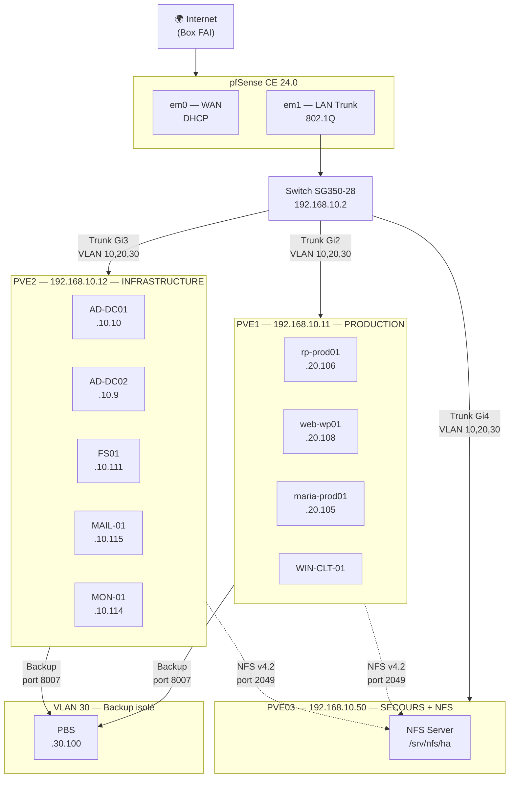
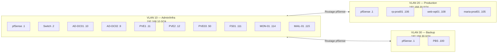
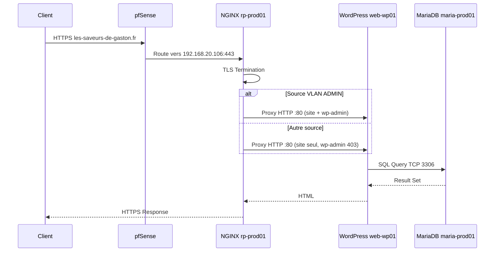
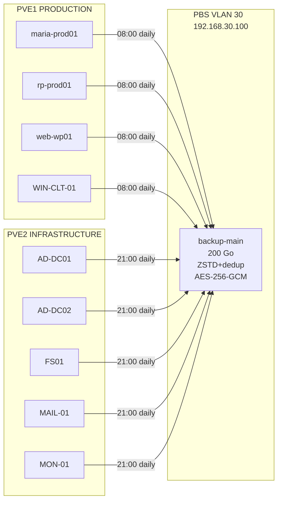

# 🏛️ Architecture — Diagrammes

## Vue d'ensemble

```mermaid
flowchart TB
    Internet["🌍 Internet\n(Box FAI)"]
    Internet --> PF

    subgraph PF["pfSense CE 24.0"]
        WAN["em0 — WAN\nDHCP"]
        LAN["em1 — LAN Trunk\n802.1Q"]
    end

    LAN --> SW["Switch SG350-28\n192.168.10.2"]

    SW -->|"Trunk Gi2\nVLAN 10,20,30"| PVE1
    SW -->|"Trunk Gi3\nVLAN 10,20,30"| PVE2
    SW -->|"Trunk Gi4\nVLAN 10,20,30"| PVE03

    subgraph PVE1["PVE1 — 192.168.10.11 — PRODUCTION"]
        RP["rp-prod01\n.20.106"]
        WP["web-wp01\n.20.108"]
        DB["maria-prod01\n.20.105"]
        CLT["WIN-CLT-01"]
    end

    subgraph PVE2["PVE2 — 192.168.10.12 — INFRASTRUCTURE"]
        DC1["AD-DC01\n.10.10"]
        DC2["AD-DC02\n.10.9"]
        FS["FS01\n.10.111"]
        MAIL["MAIL-01\n.10.115"]
        MON["MON-01\n.10.114"]
    end

    subgraph PVE03["PVE03 — 192.168.10.50 — SECOURS + NFS"]
        NFS["NFS Server\n/srv/nfs/ha"]
    end

    subgraph VLAN30["VLAN 30 — Backup isolé"]
        PBS["PBS\n.30.100"]
    end

    PVE1 & PVE2 -.->|"NFS v4.2\nport 2049"| NFS
    PVE1 & PVE2 -->|"Backup\nport 8007"| PBS
```

## Segmentation VLAN

```mermaid
flowchart LR
    subgraph V10["VLAN 10 — Admin/Infra\n192.168.10.0/24"]
        PF10["pfSense .1"]
        SW10["Switch .2"]
        DC110["AD-DC01 .10"]
        DC210["AD-DC02 .9"]
        PVE110["PVE1 .11"]
        PVE210["PVE2 .12"]
        PVE310["PVE03 .50"]
        FS10["FS01 .111"]
        MON10["MON-01 .114"]
        MAIL10["MAIL-01 .115"]
    end

    subgraph V20["VLAN 20 — Production\n192.168.20.0/24"]
        PF20["pfSense .1"]
        RP20["rp-prod01 .106"]
        WP20["web-wp01 .108"]
        DB20["maria-prod01 .105"]
    end

    subgraph V30["VLAN 30 — Backup\n192.168.30.0/24"]
        PF30["pfSense .1"]
        PBS30["PBS .100"]
    end

    V10 <-->|"Routage pfSense"| V20
    V10 <-->|"Routage pfSense"| V30
```

## Flux de données — Site web 3-tiers

```mermaid
sequenceDiagram
    participant C as Client
    participant PF as pfSense
    participant RP as NGINX rp-prod01
    participant WP as WordPress web-wp01
    participant MDB as MariaDB maria-prod01

    C->>PF: HTTPS les-saveurs-de-gaston.fr
    PF->>RP: Route vers 192.168.20.106:443
    RP->>RP: TLS Termination
    alt Source VLAN ADMIN
        RP->>WP: Proxy HTTP :80 (site + wp-admin)
    else Autre source
        RP->>WP: Proxy HTTP :80 (site seul, wp-admin 403)
    end
    WP->>MDB: SQL Query TCP 3306
    MDB-->>WP: Result Set
    WP-->>RP: HTML
    RP-->>C: HTTPS Response
```

## Flux de sauvegarde

```mermaid
flowchart LR
    subgraph P1["PVE1 PRODUCTION"]
        V1["maria-prod01"]
        V2["rp-prod01"]
        V3["web-wp01"]
        V4["WIN-CLT-01"]
    end

    subgraph P2["PVE2 INFRASTRUCTURE"]
        V5["AD-DC01"]
        V6["AD-DC02"]
        V7["FS01"]
        V8["MAIL-01"]
        V9["MON-01"]
    end

    subgraph PBS["PBS VLAN 30\n192.168.30.100"]
        DS["backup-main\n200 Go\nZSTD+dedup\nAES-256-GCM"]
    end

    V1 & V2 & V3 & V4 -->|"08:00 daily"| DS
    V5 & V6 & V7 & V8 & V9 -->|"21:00 daily"| DS
```
