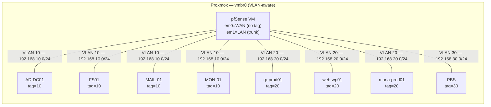

# 🧪 LAB — Networking & VLANs

## Principe : VLAN-aware bridge = switch virtuel

En LAB, le **bridge `vmbr0`** de Proxmox joue le rôle du switch SG350-28.
Chaque VM reçoit un **VLAN tag** au niveau de sa NIC virtuelle, comme un port access sur un switch.



## Plan d'adressage (identique PROD)

| VLAN | ID | Réseau | Passerelle | DHCP Range | Rôle |
|:-----|:--:|:-------|:-----------|:-----------|:-----|
| Admin | 10 | `192.168.10.0/24` | `.10.1` | `.100–.200` | Management, AD, services |
| Prod | 20 | `192.168.20.0/24` | `.20.1` | `.100–.200` | Stack web 3-tiers |
| Backup | 30 | `192.168.30.0/24` | `.30.1` | `.100–.200` | PBS isolé |
| VPN | — | `10.99.0.0/24` | `.0.1` | Dynamique | OpenVPN clients |

## Créer les VMs avec le bon VLAN tag

### Via CLI (qm)

```bash
# Exemple : créer AD-DC01 sur VLAN 10
qm create 201 --name AD-DC01 --memory 4096 --cores 2 \
  --net0 virtio,bridge=vmbr0,tag=10 \
  --scsihw virtio-scsi-single \
  --scsi0 local-lvm:32 \
  --cdrom local:iso/debian-13-amd64-netinst.iso \
  --boot order=scsi0;ide2
```

### Via WebUI

1. `Create VM` → Onglet `Network`
2. Bridge : `vmbr0`
3. **VLAN Tag** : `10` (ou `20`, `30` selon le rôle)
4. Model : `VirtIO`

## Tester la connectivité inter-VLAN

Le routage inter-VLAN est assuré par pfSense (Router-on-a-Stick) :

```bash
# Depuis AD-DC01 (VLAN 10)
ping 192.168.20.106   # rp-prod01 (VLAN 20) — doit passer via pfSense
ping 192.168.30.100   # PBS (VLAN 30)         — idem

# Depuis rp-prod01 (VLAN 20)
ping 192.168.10.10    # AD-DC01 (VLAN 10)
ping 8.8.8.8          # Internet via NAT pfSense
```

## Différences avec PROD

| Aspect | PROD (switch physique) | LAB (bridge vmbr0) |
|:-------|:-----------------------|:--------------------|
| Trunk ports | Gi1–Gi4 802.1Q | Automatique via bridge-vlan-aware |
| Access ports | Gi5–Gi24 par VLAN | Tag sur chaque vNIC |
| Port security | Ports inutilisés shutdown | N/A |
| STP | Actif sur switch | `bridge-stp off` (recommandé en VM) |
| Bande passante | 1 Gbps physique | ~10 Gbps virtio (bus mémoire) |

## Dépannage VLAN LAB

| Problème | Cause | Solution |
|:---------|:------|:---------|
| VM ne reçoit pas d'IP | VLAN tag manquant sur la NIC | Vérifier `tag=XX` dans config VM |
| Pas de ping inter-VLAN | pfSense rules manquantes | Vérifier rules sur chaque interface VLAN |
| VM atteint Internet mais pas les autres VLANs | NAT OK mais routage interne KO | Vérifier pfSense gateway sur chaque VLAN |
| Bridge ne fonctionne pas | `bridge-vlan-aware yes` manquant | Éditer `/etc/network/interfaces` et restart |
