# 💾 Backup — Proxmox Backup Server

## Architecture

```mermaid
flowchart LR
    subgraph VLAN10["VLAN 10 — Admin"]
        PVE1["PVE1"] & PVE2["PVE2"]
    end
    subgraph VLAN30["VLAN 30 — Backup (isolé)"]
        PBS["PBS\n192.168.30.100:8007"]
        DS["backup-main\n200 Go · ZSTD · AES-256-GCM"]
    end
    PVE1 -->|"08:00 daily"| PBS
    PVE2 -->|"21:00 daily"| PBS
    PBS --- DS
```



## Jobs planifiés

| Job | Heure | VMs | Rétention | Source |
|:----|:-----:|:----|:----------|:-------|
| backup-prod | 08:00 | maria-prod01, rp-prod01, web-wp01, WIN-CLT-01 | 90 jours | PVE1 |
| backup-infra | 21:00 | AD-DC01, AD-DC02, FS01, MAIL-01, MON-01 | 90 jours | PVE2 |

**Total : 9 VMs sauvegardées**, chiffrement AES-256-GCM côté client, déduplication ~70-90 %.

## Opérations courantes

### Vérifier l'état

```bash
# Sur PBS
proxmox-backup-manager datastore list
proxmox-backup-manager datastore status backup-main
df -h /mnt/datastore/backup-main/
```

### Lancer un backup manuel

PVE WebUI → `Datacenter > Backup > Run Now`

### Restaurer une VM

PVE WebUI → `Storage > pbs > Content` → sélectionner le backup → `Restore`

### Vérifier l'intégrité

```bash
proxmox-backup-client verify --repository backup@pbs:backup-main
```

## Maintenance

- **Mensuel** : test de restauration d'au moins 1 VM
- **Hebdomadaire** : vérifier l'espace disque (`df -h`)
- **Quotidien** : vérifier que les jobs ont réussi (WebUI PBS ou Checkmk alerts)

## Rollback PBS

Si PBS est corrompu :

1. Réinstaller PBS (Debian 12 + pbs-no-subscription repo)
2. Re-monter le disque `/mnt/datastore/backup-main` — les données persistent
3. Re-créer le datastore : `proxmox-backup-manager datastore create backup-main /mnt/datastore/backup-main`
4. Re-intégrer dans PVE : `Datacenter > Storage > Add > PBS`
