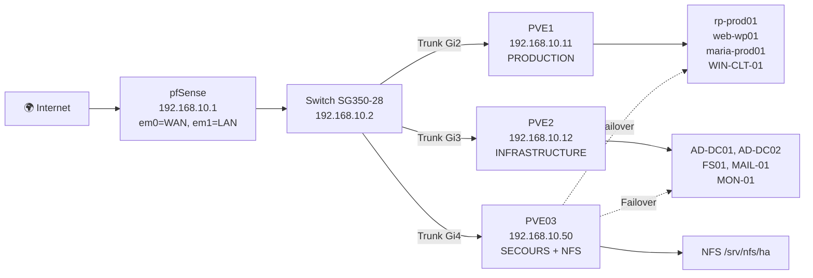

# 🏭 PROD — Vue d'ensemble

## Architecture cible

Déploiement complet sur **3 serveurs physiques** + 1 PC pfSense + 1 switch managé.

## Matériel requis

| # | Équipement | Modèle de référence | Rôle |
|:-:|:-----------|:--------------------|:-----|
| 1 | Serveur Production | HP ProLiant DL360 Gen10+ | PVE1 — VMs web 3-tiers |
| 2 | Serveur Infrastructure | HP ProLiant DL360 Gen10+ | PVE2 — VMs services core |
| 3 | Serveur Secours + NFS | HP ProLiant DL360 Gen10+ | PVE03 — Stockage partagé + failover |
| 4 | PC Firewall | i5, 16 Go RAM, 256 Go SSD, **2 NIC GbE** | pfSense CE 24.0 |
| 5 | Switch | Cisco SG350-28 | 24 GbE + 4 SFP, VLAN 802.1Q |
| 6 | Onduleur (×2) | APC Smart-UPS 1500VA | Protection électrique |
| 7 | Rack | 19" 12U mural | Hébergement |

## ISOs nécessaires

- [ ] Proxmox VE 9.0
- [ ] Debian 13 Trixie (VMs infra : AD, Monitoring, Mail)
- [ ] Debian 12 Bookworm (VMs prod : web, DB, RP + PBS)
- [ ] pfSense CE 24.0
- [ ] Windows Server 2022 Datacenter (FS01)

## Guides

| Étape | Guide | Durée |
|:------|:------|:-----:|
| 1. Déploiement J0 | [day0-runbook.md](day0-runbook.md) | 10 h |
| 2. Tests de validation | [validation.md](validation.md) | 1 h |
| 3. Opérations quotidiennes | [ops/](../ops/) | Continu |

---

## 🔧 Ce qui reste manuel et pourquoi

Certains composants ne sont **pas** automatisés par Terraform/Ansible.
C'est un choix de conception documenté — pas un oubli.

| Composant | Raison | Référence |
|:----------|:-------|:----------|
| **pfSense** | Pas d'API Terraform fiable et stable. Configuration via WebUI, export XML pour sauvegarde. | [configs/pfsense/](../../configs/pfsense/) |
| **Samba AD** | Provisionnement automatisable mais risque élevé (annuaire = critique). Scripts templates fournis, exécution manuelle contrôlée. | [configs/samba/](../../configs/samba/) |
| **PBS** | Intégration PVE↔PBS partiellement manuelle selon l'infrastructure physique (datastores, réplication). | [docs/ops/backup.md](../ops/backup.md) |
| **FS01 Windows** | Dépend d'un template sysprep (non généré automatiquement). Configuration post-deploy via scripts PowerShell. | [automation/powershell/](../../automation/powershell/) |
| **Switch SG350** | Configuration VLAN via WebUI Cisco. Pas d'API IaC standard pour ce modèle. | [runbooks/](../../runbooks/) |
| **Proxmox cluster** | Mise en cluster (`pvecm`) = opération manuelle unique sur chaque nœud physique. | [day0-runbook.md](day0-runbook.md) |

> **Philosophie :** les checklists et templates sont fournis pour chaque composant manuel.
> L'objectif est la **reproductibilité documentée**, pas l'automatisation totale à tout prix.
