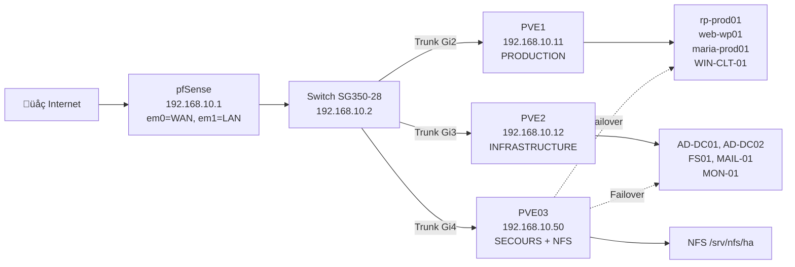

# 🏭 PROD — Vue d'ensemble

## Architecture cible

Déploiement complet sur **3 serveurs physiques** + 1 PC pfSense + 1 switch managé.

```mermaid
flowchart LR
    Internet["üåç Internet"] --> PF["pfSense\n192.168.10.1\nem0=WAN, em1=LAN"]
    PF --> SW["Switch SG350-28\n192.168.10.2"]

    SW -->|"Trunk Gi2"| PVE1["PVE1\n192.168.10.11\nPRODUCTION"]
    SW -->|"Trunk Gi3"| PVE2["PVE2\n192.168.10.12\nINFRASTRUCTURE"]
    SW -->|"Trunk Gi4"| PVE03["PVE03\n192.168.10.50\nSECOURS + NFS"]

    PVE1 --> V1["rp-prod01\nweb-wp01\nmaria-prod01\nWIN-CLT-01"]
    PVE2 --> V2["AD-DC01, AD-DC02\nFS01, MAIL-01\nMON-01"]
    PVE03 --> NFS["NFS /srv/nfs/ha"]
    PVE03 -.->|"Failover"| V1 & V2
```

## Matériel requis

| # | Équipement | Modèle de référence | Rôle |
|:-:|:-----------|:--------------------|:-----|
| 1 | Serveur Production | HP ProLiant DL360 Gen10+ | PVE1 — VMs web 3-tiers |
| 2 | Serveur Infrastructure | HP ProLiant DL360 Gen10+ | PVE2 — VMs services core |
| 3 | Serveur Secours + NFS | HP ProLiant DL360 Gen10+ | PVE03 — Stockage partagé + failover |
| 4 | PC Firewall | i5, 16 Go RAM, 256 Go SSD, **2 NIC GbE** | pfSense CE 24.0 |
| 5 | Switch | Cisco SG350-28 | 24 GbE + 4 SFP, VLAN 802.1Q |
| 6 | Onduleur (×2) | APC Smart-UPS 1500VA | Protection électrique |
| 7 | Rack | 19" 12U mural | Hébergement |

## ISOs nécessaires

- [ ] Proxmox VE 9.0
- [ ] Debian 13 Trixie (VMs infra : AD, Monitoring, Mail)
- [ ] Debian 12 Bookworm (VMs prod : web, DB, RP + PBS)
- [ ] pfSense CE 24.0
- [ ] Windows Server 2022 Datacenter (FS01)

## Guides

| Étape | Guide | Durée |
|:------|:------|:-----:|
| 1. Déploiement J0 | [day0-runbook.md](day0-runbook.md) | 10 h |
| 2. Tests de validation | [validation.md](validation.md) | 1 h |
| 3. Opérations quotidiennes | [ops/](../ops/) | Continu |
