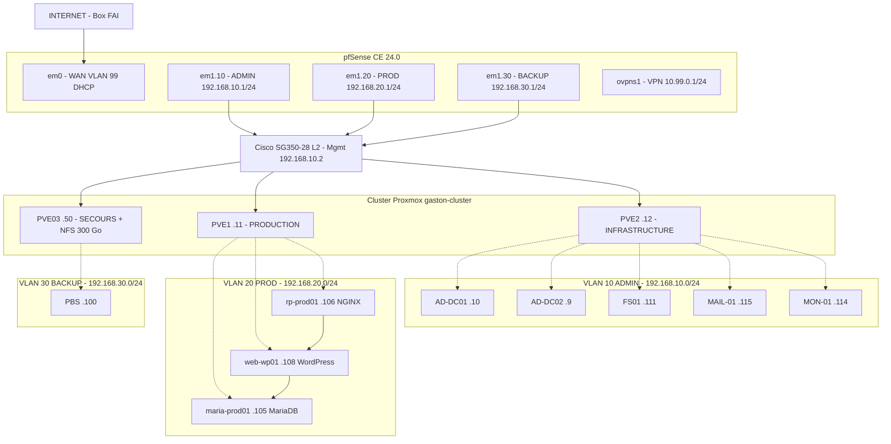
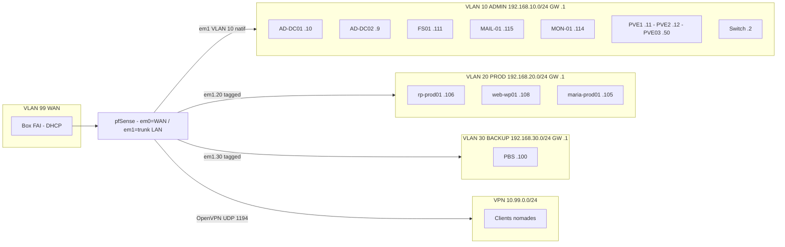
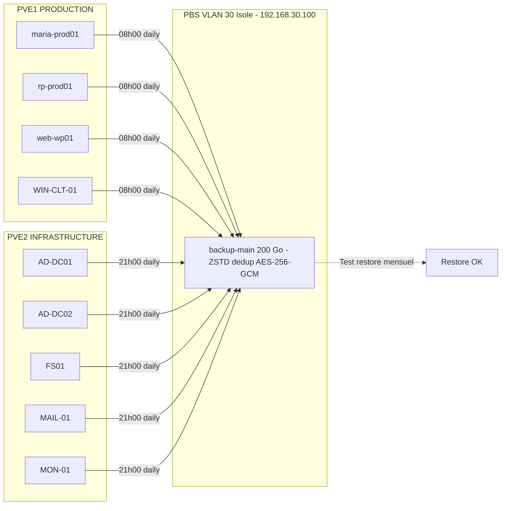
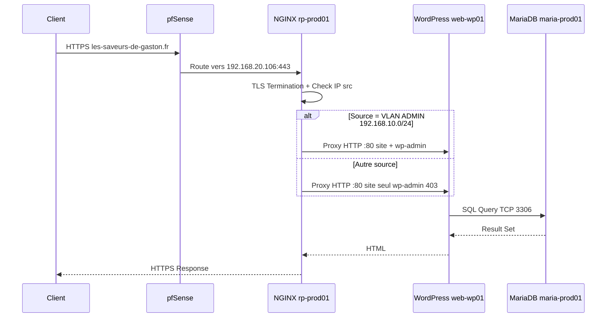

# RUNBOOK — Déploiement Architecture Complète en 1 Jour

## Les Saveurs de Gaston — Infrastructure Enterprise-Grade

| Métadonnée | Valeur |
|:---|:---|
| **Version** | 2.0 |
| **Date** | 2026-02-09 |
| **Auteur** | Équipe Infrastructure — Les Saveurs de Gaston |
| **Durée estimée** | 1 journée (08 h 00 → 18 h 00) — MVP opérationnel |
| **Niveau** | Exécution — Technicien / Administrateur Systèmes & Réseau |
| **Statut** | Prêt à exécuter |

---

## CHANGELOG (v2.0)

- Ajout d'une table des matières cliquable.
- Correction des IPs PVE : `.116/.117/.118` remplacées par `.11/.12/.50` (source : Cluster HA).
- Harmonisation interface pfSense : précise que `em0` = WAN (dédié) et `em1` = LAN trunk (source : Switch SG350-28 §3.2). Le runbook v1 présentait `em0.XX` partout.
- Suppression de VLAN 99 sur le trunk Gi1 du switch (VLAN 99 = WAN physique séparé, ne transite pas sur le SG350).
- Correction du nombre de VMs sauvegardées par PBS : 9 (4 PROD + 5 INFRA), et non 8 (source : PBS §5.3).
- Ajout de la règle PROD→AD RPC Dynamic (ports 49152-65535) manquante dans les règles FW PROD (source : pfSense §6.4).
- Uniformisation DHCP range `.100 → .200` (choix pfSense §4.4 ; note : Switch doc indique `.199`).
- Marquage TODO de toutes les valeurs contradictoires entre sources (SNMP community, LDAP auth container, IPs PROD dans Infra Overview/Budget).
- Ajout section **Sécurité Minimale J0** dédiée.
- Ajout critères d'acceptation par bloc (pas uniquement en section 5).
- Ajout étape NTFS pour FS01 (source : FS01 doc §4.4).
- Correction Checkmk : méthode d'initialisation du mot de passe `cmkadmin` (`omd su gaston -- cmk-passwd cmkadmin`).
- Suppression affirmations marketing non actionnables.
- Ajout REGISTRE TODO centralisé en fin de document.
- Mermaid : corrigé syntaxe (guillemets, longueur lignes, nœuds).

---

## Table des Matières

- [0. Contexte, Périmètre, Hypothèses](#0-contexte-périmètre-hypothèses)
- [1. Architecture Cible](#1-architecture-cible)
- [2. Prérequis — Avant de Commencer](#2-prérequis--avant-de-commencer)
- [3. Plan d'Exécution sur 1 Journée](#3-plan-dexécution-sur-1-journée)
- [4. Mise en Oeuvre Pas-à-Pas](#4-mise-en-oeuvre-pas-à-pas)
  - [4.1 Switch Cisco SG350-28](#41-switch-cisco-sg350-28)
  - [4.2 pfSense — Firewall, Routage, DHCP, DNS, VPN](#42-pfsense)
  - [4.3 Cluster Proxmox VE](#43-cluster-proxmox-ve)
  - [4.4 Samba AD DC1 / DC2](#44-samba-ad-dc1--dc2)
  - [4.5 Services Socle — FS01, MAIL-01](#45-services-socle)
  - [4.6 Supervision — MON-01 Checkmk](#46-supervision--mon-01-checkmk)
  - [4.7 Sauvegardes — PBS](#47-sauvegardes--pbs)
  - [4.8 Production Web — 3-Tiers](#48-production-web--3-tiers)
- [5. Sécurité Minimale J0](#5-sécurité-minimale-j0)
- [6. Checklist de Recette Globale](#6-checklist-de-recette-globale)
- [7. Dépannage Rapide](#7-dépannage-rapide)
- [8. Plan de Rollback](#8-plan-de-rollback)
- [9. Justification des Choix](#9-justification-des-choix)
- [10. Risques Connus et Mitigations](#10-risques-connus-et-mitigations)
- [11. Tâches Post-J0](#11-tâches-post-j0)
- [12. Résumé Ultra-Condensé](#12-résumé-ultra-condensé)
- [Annexe A — Plan IP / VLAN Complet](#annexe-a--plan-ip--vlan-complet)
- [Annexe B — Matrice des Flux](#annexe-b--matrice-des-flux)
- [Annexe C — Commandes Essentielles](#annexe-c--commandes-essentielles)
- [Annexe D — REGISTRE TODO](#annexe-d--registre-todo)

---

## 0. Contexte, Périmètre, Hypothèses

### 0.1 Contexte

Les Saveurs de Gaston est boutique en ligne de vente de complément (~1 000 €/jour de CA, ~10 collaborateurs, ~150 utilisateurs AD). Le SI existant repose sur un NAS personnel reconverti (SPOF absolu, score de maturité SI : **15/100**). Ce runbook déploie en 1 journée un socle complet : virtualisation HA, identité, réseau segmenté, production web 3-tiers, sauvegarde, supervision.

### 0.2 Périmètre

| Inclus (MVP J0) | Hors périmètre (J+1 à J+7) |
|:---|:---|
| Switch L2 + VLANs | Hardening avancé GPO (~30 GPO) |
| pfSense (FW, VPN, DHCP, DNS) | Intégration GLPI complète |
| Cluster Proxmox 3 nœuds + NFS HA | Tests de charge / perf web |
| Samba AD (DC01 + DC02) + DNS interne | Audit sécurité externe |
| FS01 (partages SMB RBAC) | Onboarding utilisateurs complet (~150) |
| MAIL-01 (Mailcow) | SPF/DKIM/DMARC validation externe |
| MON-01 (Checkmk) | Dashboards avancés / SLA reporting |
| PBS (backup + test restore) | Backup hors-site (3-2-1 complet) |
| Prod Web 3-tiers (NGINX/WP/MariaDB) | WooCommerce configuration métier |

### 0.3 Hypothèses

- [ ] 3 serveurs physiques (HP ProLiant DL360 Gen10+) rack-montés, câblés, sous tension.
- [ ] 1 PC dédié pfSense (i5, 16 Go RAM, 256 Go SSD, **2 NIC GbE minimum**) prêt.
- [ ] 1 Switch Cisco SG350-28 en place et alimenté.
- [ ] Accès Internet opérationnel via box/modem FAI.
- [ ] ISOs : Proxmox VE 9.0, Debian 13 (Trixie), Debian 12 (Bookworm pour PBS), pfSense CE 24.0, Windows Server 2022 Datacenter.
- [ ] 2 onduleurs APC Smart-UPS 1500VA branchés.
- [ ] 1 technicien dédié à temps plein.
- [ ] Tous les mots de passe générés à l'avance (voir §2.3).

### 0.4 Glossaire

| Terme | Définition |
|:---|:---|
| HA | Haute Disponibilité |
| VLAN | Virtual LAN — segmentation logique |
| RBAC | Role-Based Access Control |
| AGDLP | Account → Global → Domain Local → Permission |
| PBS | Proxmox Backup Server |
| RTO / RPO | Durée max d'indisponibilité / Perte de données max |
| SPOF | Single Point of Failure |

### 0.5 Inventaire Matériel

| # | Équipement | Modèle | Rôle | Qté |
|:-:|:---|:---|:---|:-:|
| 1 | Serveur Production | HP ProLiant DL360 Gen10+ | PVE1 | 1 |
| 2 | Serveur Infrastructure | HP ProLiant DL360 Gen10+ | PVE2 | 1 |
| 3 | Serveur Secours + NFS | HP ProLiant DL360 Gen10+ | PVE03 | 1 |
| 4 | PC Firewall | Assemblé (i5, 16 Go, 256 Go SSD, 2 NIC) | pfSense CE 24.0 | 1 |
| 5 | Switch | Cisco SG350-28 (24 GbE + 4 SFP) | Commutation L2 / 802.1Q | 1 |
| 6 | Onduleur | APC Smart-UPS 1500VA | Protection électrique | 2 |
| 7 | Rack | 19" 12U mural | Hébergement physique | 1 |

---

## 1. Architecture Cible

### 1.1 Diagramme Global



### 1.2 Diagramme Réseau VLAN



### 1.3 Principes d'Architecture

| Principe | Implémentation | Justification |
|:---|:---|:---|
| Haute Disponibilité | Cluster PVE 3 nœuds, 2 DC Samba, NFS partagé | RTO < 90 s, tolérance panne N+1, quorum garanti |
| Segmentation réseau | 4 VLANs via 802.1Q | Isolation des domaines, réduction surface attaque |
| Moindre privilège | RBAC AGDLP, deny-by-default pfSense, tiering Microsoft | Accès limité au strict nécessaire |
| Défense en profondeur | pfSense + UFW + Fail2ban + SSH clé-only + TLS | Couches de sécurité multiples |
| Sauvegarde | PBS dédupliqué + VLAN isolé + rétention 3 mois | Protection données, conformité RGPD |
| Observabilité | Checkmk agents TLS sur 12 hôtes, SNMP pfSense | Détection proactive des pannes |

---

## 2. Prérequis — Avant de Commencer

Durée estimée : **30 – 45 min**.

### 2.1 Checklist Pré-déploiement

- [ ] Accès physique aux 3 serveurs, PC pfSense, switch — alimentation + câbles réseau vérifiés.
- [ ] Console (écran + clavier) ou IPMI/iLO fonctionnel sur chaque serveur.
- [ ] ISOs disponibles sur clé USB ou montage réseau.
- [ ] Câblage réseau :
  - PC pfSense NIC `em0` → box FAI (WAN).
  - PC pfSense NIC `em1` → port Gi1 du SG350.
  - PVE1 → Gi2, PVE2 → Gi3, PVE03 → Gi4.
- [ ] Accès Internet opérationnel (test : `ping 8.8.8.8` depuis la box).
- [ ] Licences Windows Server 2022 Datacenter prêtes.
- [ ] Mots de passe générés et stockés (§2.3).

### 2.2 Paramètres Critiques

| Paramètre | Valeur |
|:---|:---|
| Domaine AD | `gaston.local` (NetBIOS : `GASTON`) |
| VLAN 10 ADMIN | `192.168.10.0/24`, GW `.1` |
| VLAN 20 PROD | `192.168.20.0/24`, GW `.1` |
| VLAN 30 BACKUP | `192.168.30.0/24`, GW `.1` |
| VLAN 99 WAN | DHCP (FAI) |
| VPN Tunnel | `10.99.0.0/24` |
| DNS Primaire | `192.168.10.10` (AD-DC01) |
| DNS Secondaire | `192.168.10.9` (AD-DC02) |
| DNS Fallback | `1.1.1.1` (pfSense uniquement) |
| NTP | `pool.ntp.org` (via pfSense) |
| Timezone | `Europe/Paris` |
| Switch Mgmt IP | `192.168.10.2` |
| Cluster Proxmox | `gaston-cluster` |
| NFS Export | `/srv/nfs/ha` sur PVE03 (192.168.10.50), 300 Go, NFS v4.2 |
| Stockage ID NFS | `ha-nfs` |
| PBS Datastore | `backup-main` sur `/mnt/datastore/backup-main`, 200 Go |
| Checkmk Site | `gaston` — URL : `https://mon-01.gaston.local/gaston` |
| Mailcow hostname | `mail.gaston.local` |
| Site Web FQDN | `les-saveurs-de-gaston.fr` |

### 2.3 Comptes Administrateurs

Générer tous les mots de passe **avant J0** (≥ 16 caractères, majuscules, minuscules, chiffres, spéciaux). Les stocker dans un gestionnaire de mots de passe chiffré.

| Compte | Usage |
|:---|:---|
| `root` (PVE ×3) | Administration Proxmox |
| `admin` (pfSense) | Administration Firewall |
| `Administrator` (AD) | Domain Admin Samba |
| `adm-mathieu.dupont` | Tier-0 Admin AD |
| `admin` (Mailcow) | Administration messagerie |
| `cmkadmin` (Checkmk) | Administration monitoring |
| `backup@pbs` | Utilisateur API backup PBS |
| `admin` (WordPress) | Administration CMS |
| `svc-ldap-pfsense` | Service LDAP bind pfSense → AD |
| `svc-backup` | Service compte backup |
| `svc-monitoring` | Service compte monitoring |

### 2.4 Ports Réseau Requis

| Service | Port(s) | Proto | Direction |
|:---|:---|:---|:---|
| SSH | 22 | TCP | Admin → Serveurs |
| DNS | 53 | TCP/UDP | Tous → AD-DC01/DC02 |
| HTTP/HTTPS | 80, 443 | TCP | Clients → RP / pfSense / Mailcow |
| Kerberos | 88, 464 | TCP/UDP | Membres domaine → DC |
| NTP | 123 | UDP | DC → pfSense |
| RPC Endpoint Mapper | 135 | TCP | Membres domaine → DC |
| LDAP/LDAPS | 389, 636 | TCP | Services → DC |
| SMB | 445 | TCP | Clients → FS01 |
| SMTP Submission / IMAPS | 587, 993 | TCP | Clients → MAIL-01 |
| NFS | 2049 | TCP | PVE → PVE03 |
| MariaDB | 3306 | TCP | web-wp01 → maria-prod01 |
| Global Catalog | 3268, 3269 | TCP | Membres domaine → DC |
| Corosync | 5405-5412 | UDP | PVE ↔ PVE |
| Checkmk Agent | 6556 | TCP | MON-01 → Tous hôtes |
| PBS API | 8007 | TCP | PVE → PBS |
| Proxmox Web | 8006 | TCP | Admin → PVE |
| OpenVPN | 1194 | UDP | Internet → pfSense WAN |
| SNMP | 161 | UDP | MON-01 → pfSense / Switch |
| AD RPC Dynamic | 49152-65535 | TCP | Membres domaine → DC |

---

## 3. Plan d'Exécution sur 1 Journée

```mermaid
gantt
    title Planning J0 - Les Saveurs de Gaston
    dateFormat HH:mm
    axisFormat %H:%M

    section Réseau L2
    Switch SG350 VLANs + Trunks           :s1, 08:00, 45min

    section Firewall
    pfSense Install + Interfaces           :s2, 08:45, 45min
    pfSense DHCP + DNS + FW Rules          :s3, after s2, 45min
    pfSense VPN OpenVPN                    :s4, after s3, 30min

    section Virtualisation
    Proxmox Install 3 noeuds              :s5, 08:00, 60min
    Cluster + NFS + HA                    :s6, after s5, 45min

    section GO-NO-GO
    Point de controle mi-journee          :milestone, 12:00, 0min

    section Identite
    AD-DC01 Samba AD Primary              :s7, 12:15, 45min
    AD-DC02 Replica + DNS                 :s8, after s7, 30min

    section Services Socle
    FS01 File Server                      :s9, after s8, 30min
    MAIL-01 Mailcow                       :s10, after s8, 45min
    MON-01 Checkmk                        :s11, after s9, 30min

    section Sauvegarde
    PBS Install + Datastore               :s12, after s10, 30min
    PBS Integration PVE + Test            :s13, after s12, 20min

    section Production Web
    VMs Web 3-tiers                       :s14, after s11, 60min
    Tests + Validation                    :s15, after s14, 30min

    section Recette
    Securite + Checklist finale           :s16, 17:00, 60min
```



### Planning Heure par Heure

| Heure | Bloc | Activité | Durée | Dépendances |
|:---|:---|:---|:---|:---|
| 08:00 | Réseau | Switch SG350 : VLANs 10/20/30, trunks Gi1-Gi4 | 45 min | — |
| 08:00 | Virtualisation | Install PVE sur 3 nœuds (en parallèle du switch) | 60 min | — |
| 08:45 | Firewall | Install pfSense + config interfaces VLAN | 45 min | Switch prêt |
| 09:30 | Firewall | DHCP + DNS Resolver + Domain Override | 45 min | pfSense installé |
| 09:45 | Virtualisation | Création cluster + NFS + HA Manager | 45 min | Proxmox installé |
| 10:15 | Firewall | Règles FW minimales + NAT + VPN | 30 min | DHCP/DNS ok |
| 10:30 | Virtualisation | Création VMs (Debian 13 / Win 2022) | 45 min | Cluster opérationnel |
| 11:15 | — | Tests réseau : ping inter-VLAN, Internet, trunks | 15 min | FW + Switch + Cluster |
| 11:30 | — | Buffer / rattrapage retard | 30 min | — |
| **12:00** | **GO/NO-GO** | **Point de contrôle mi-journée** | **15 min** | Tout ci-dessus |
| 12:15 | Identité | AD-DC01 : provisioning Samba AD, DNS, OU, groupes | 45 min | VM + réseau OK |
| 13:00 | Identité | AD-DC02 : join domain, réplication | 30 min | DC01 opérationnel |
| 13:30 | Services | FS01 : join domain, partages SMB, RBAC | 30 min | AD opérationnel |
| 13:30 | Services | MAIL-01 : Mailcow docker compose up (parallèle FS01) | 45 min | AD + DNS ok |
| 14:00 | Services | MON-01 : Checkmk install, site gaston, agents | 30 min | FS01 terminé |
| 14:15 | Sauvegarde | PBS : install, datastore, intégration PVE | 30 min | MAIL-01 terminé |
| 14:45 | Sauvegarde | PBS : test restore rapide | 20 min | PBS intégré |
| 15:05 | Prod Web | maria-prod01 : MariaDB + base WordPress | 20 min | VLAN 20 ok |
| 15:25 | Prod Web | web-wp01 : Apache + PHP + WordPress | 20 min | MariaDB prête |
| 15:45 | Prod Web | rp-prod01 : NGINX reverse proxy + TLS | 20 min | WordPress prêt |
| 16:05 | Prod Web | Tests web : HTTP 200, /wp-admin filtré | 15 min | Stack web complète |
| 16:20 | Monitoring | Ajout de tous les hôtes dans Checkmk | 30 min | Tous services up |
| 16:50 | VPN | Test connexion VPN + accès ressources | 10 min | VPN configuré |
| 17:00 | Recette | Sécurité J0 + Checklist globale | 60 min | Tout déployé |
| **18:00** | **FIN** | **MVP opérationnel** | — | — |

> **Durée totale** : ~10 h effectives. La parallélisation Switch/PVE install à 08:00, et FS01/MAIL à 13:30, est impérative pour tenir dans l'enveloppe.

### GO/NO-GO (12 h 00)

> **Critères obligatoires avant de continuer :**
>
> | # | Critère | Commande de vérification | Résultat attendu |
> |:-:|:---|:---|:---|
> | 1 | Quorum Proxmox 3/3 | `pvecm status` | `Quorate: Yes`, `Total Votes: 3` |
> | 2 | Ping VLAN 10 → 20 | `ping 192.168.20.1` depuis VLAN 10 | Reply |
> | 3 | Ping VLAN 10 → 30 | `ping 192.168.30.1` depuis VLAN 10 | Reply |
> | 4 | Accès Internet | `ping 8.8.8.8` depuis VLAN 10 | Reply |
> | 5 | DNS Resolver | `nslookup google.com 192.168.10.1` | Résolu |
> | 6 | NFS monté | `pvesm status` → `ha-nfs` | `active` |
>
> **Si 1+ critère échoue** : diagnostiquer avant de continuer. Les services AD/Mail/Web dépendent du socle réseau + cluster.

---

## 4. Mise en Oeuvre Pas-à-Pas

---

### 4.1 Switch Cisco SG350-28

| | |
|:---|:---|
| **Objectif** | Créer les VLANs 10, 20, 30 ; configurer les trunks vers pfSense et Proxmox ; sécuriser le management. |
| **Pré-requis** | Switch alimenté, câble console ou accès Web UI (défaut : `192.168.1.254`). |
| **Durée** | 45 min |

**1. Accès initial.** Connecter un poste sur un port access, IP du poste `192.168.1.x/24`. Accéder à `https://192.168.1.254` → login `cisco / cisco` → changer immédiatement le mot de passe.

**2. IP Management.** `Administration > Management Interface > IPv4 Address` :

| Paramètre | Valeur |
|:---|:---|
| IP | `192.168.10.2` |
| Masque | `255.255.255.0` |
| Gateway | `192.168.10.1` |
| VLAN Management | `10` |

**3. Créer les VLANs.** `VLAN Management > VLAN Settings > Add` :

| VLAN ID | Nom | Usage |
|:-:|:---|:---|
| 10 | ADMIN | Administration, infrastructure (VLAN natif trunk Gi1) |
| 20 | PROD | Production web |
| 30 | BACKUP | Sauvegarde isolée |

**4. Configurer les ports.** `VLAN Management > Port VLAN Membership` :

| Port | Mode | VLAN Natif (Untagged) | VLANs Tagged | Connexion |
|:---|:---|:---|:---|:---|
| Gi1 | Trunk | 10 | 20, 30 | pfSense NIC `em1` |
| Gi2 | Trunk | aucun | 10, 20, 30 | PVE1 |
| Gi3 | Trunk | aucun | 10, 20, 30 | PVE2 |
| Gi4 | Trunk | aucun | 10, 20, 30 | PVE03 |
| Gi5 – Gi12 | Access | 10 | — | Postes admin |
| Gi13 – Gi20 | Access | 20 | — | Postes production (futur) |
| Gi21 – Gi28 | — | — | — | **Shutdown** |

> Le VLAN 99 (WAN) **ne transite pas sur le switch**. Le WAN utilise une NIC physique séparée (`em0`) connectée directement à la box FAI.

**5. Sécurité.**

- [ ] Mot de passe changé.
- [ ] Ports Gi21-Gi28 désactivés : `Port Management > Port Settings > Admin Status: Down`.
- [ ] STP : mode Rapid-PVST activé.
- [ ] PortFast + BPDU Guard sur ports access (Gi5-Gi20).
- [ ] Storm Control 10 % sur ports access.
- [ ] SNMP activé : communauté RO = `gaston_monitor`.
- [ ] HTTP désactivé, HTTPS activé, Telnet désactivé, SSH v2 activé.
- [ ] Sauvegarder : `Administration > File Management > Copy Running to Startup`.

> **Justification** : L2 pur centralise le contrôle sur pfSense (Router-on-a-Stick). Ports inutilisés désactivés = réduction surface attaque physique.

**Critères d'acceptation :**

- [ ] `https://192.168.10.2` accessible depuis VLAN 10.
- [ ] VLANs 10, 20, 30 visibles dans `VLAN Management`.
- [ ] Gi1 – Gi4 Link Up dans `Port Management`.
- [ ] Config persistée (copie running → startup).

**Rollback** : Maintenir bouton RESET 10 s → factory reset, reconfigurer.

---

### 4.2 pfSense

| | |
|:---|:---|
| **Objectif** | Installer pfSense CE 24.0 (FreeBSD 14.0), configurer interfaces VLAN, routage inter-VLAN, DHCP, DNS, firewall, VPN OpenVPN. |
| **Pré-requis** | PC pfSense câblé (em0 → box FAI, em1 → Gi1 switch), ISO sur USB. |
| **Durée** | 2 h 00 |

#### 4.2.1 Installation (45 min)

1. Booter sur USB pfSense CE 24.0.
2. Installer sur SSD 256 Go (UFS).
3. Reboot, console :
   - Assigner `em0` comme WAN.
   - Assigner `em1` comme LAN.
4. Configurer via console : LAN IP `192.168.10.1/24`.
5. Accéder au WebUI depuis VLAN 10 : `https://192.168.10.1`.
6. Wizard : hostname `pfSense`, domain `gaston.local`, timezone `Europe/Paris`.

> L'interface physique `em0` est dédiée au WAN (DHCP FAI). L'interface `em1` porte le trunk 802.1Q vers le switch. Les noms exacts (`em0`, `em1`, `igb0`, `igb1`…) dépendent du matériel — adapter en conséquence.

#### 4.2.2 Interfaces VLAN

`Interfaces > Assignments > VLANs` → Créer :

| Interface | VLAN Tag | Parent | IP | Description |
|:---|:-:|:---|:---|:---|
| WAN | — | em0 | DHCP | Internet |
| LAN | 10 | em1 | 192.168.10.1/24 | ADMIN |
| PROD | 20 | em1 | 192.168.20.1/24 | Production Web |
| BACKUP | 30 | em1 | 192.168.30.1/24 | Sauvegarde |

`Interfaces > Assignments` → assigner les nouvelles interfaces, activer, configurer IPv4 Static.

#### 4.2.3 DHCP Server

`Services > DHCP Server` — configurer par interface :

| Interface | Plage | Gateway | DNS 1 | DNS 2 | Domain | Lease |
|:---|:---|:---|:---|:---|:---|:---|
| LAN (VLAN 10) | .100 → .200 | 192.168.10.1 | 192.168.10.10 | 192.168.10.9 | gaston.local | 86400 s |
| PROD (VLAN 20) | .100 → .200 | 192.168.20.1 | 192.168.10.10 | 192.168.10.9 | gaston.local | 86400 s |
| BACKUP (VLAN 30) | .100 → .200 | 192.168.30.1 | 192.168.10.10 | 192.168.10.9 | gaston.local | 86400 s |

> Les serveurs à IP statique utilisent des adresses < .100 (hors plage DHCP).

#### 4.2.4 DNS Resolver

`Services > DNS Resolver` :

1. Activer Unbound, écouter sur toutes les interfaces.
2. Activer DNSSEC.
3. **Domain Override** : `gaston.local` → `192.168.10.10` (AD-DC01).
4. `System > General Setup` : DNS = `192.168.10.10`, fallback `1.1.1.1`.

#### 4.2.5 Aliases

`Firewall > Aliases` — créer :

**Réseaux :**

| Alias | Type | Valeur |
|:---|:---|:---|
| NET_LAN_ADMIN | Network | 192.168.10.0/24 |
| NET_PROD | Network | 192.168.20.0/24 |
| NET_BACKUP | Network | 192.168.30.0/24 |
| NET_VPN | Network | 10.99.0.0/24 |

**Hôtes :**

| Alias | Valeur |
|:---|:---|
| HOST_ADDC01 | 192.168.10.10 |
| HOST_ADDC02 | 192.168.10.9 |
| HOST_FS01 | 192.168.10.111 |
| HOST_MAIL | 192.168.10.115 |
| HOST_PBS | 192.168.30.100 |
| HOST_GLPI | 192.168.10.122 |
| MON_CHECKMK | 192.168.10.114 |

**Ports :**

| Alias | Ports |
|:---|:---|
| PORTS_WEB | 80, 443 |
| PORTS_AD_CORE | 53, 88, 123, 135, 389, 445, 464, 636, 3268, 3269 |
| PORTS_AD_RPC_DYN | 49152-65535 |
| PORT_CHECKMK_AGENT | 6556 |
| PORT_PBS | 8007 |

#### 4.2.6 Règles Firewall

`Firewall > Rules` — créer par interface. **Politique : deny-by-default.**

**WAN :**

| # | Action | Source | Dest | Port | Proto | Description |
|:-:|:---|:---|:---|:---|:---|:---|
| 1 | PASS | Any | WAN address | 1194 | UDP | OpenVPN |

**LAN (ADMIN) :**

| # | Action | Source | Dest | Port | Proto | Description |
|:-:|:---|:---|:---|:---|:---|:---|
| 1 | PASS | NET_LAN_ADMIN | HOST_PBS | 8007 | TCP | Admin → PBS |
| 2 | PASS | NET_LAN_ADMIN | HOST_GLPI | 80, 443 | TCP | Admin → GLPI |
| 3 | PASS | NET_LAN_ADMIN | NET_PROD | 80, 443 | TCP | Admin → PROD Web |
| 4 | PASS | NET_LAN_ADMIN | NET_PROD | 3389 | TCP | Admin → PROD RDP |
| 5 | PASS | MON_CHECKMK | This Firewall | 161 | UDP | Checkmk SNMP |
| 6 | PASS | MON_CHECKMK | NET_PROD | ICMP | — | Checkmk Ping PROD |
| 7 | PASS | MON_CHECKMK | NET_PROD | 6556 | TCP | Checkmk Agent PROD |
| 8 | PASS | MON_CHECKMK | HOST_PBS | ICMP, 6556 | TCP | Checkmk PBS |
| 9 | PASS | HOST_ADDC01, HOST_ADDC02 | Any | 53 | TCP/UDP | DC DNS récursion |
| 10 | PASS | NET_LAN_ADMIN | Any | 80, 443 | TCP | Admin → Internet |

**PROD (VLAN 20) :**

| # | Action | Source | Dest | Port | Proto | Description |
|:-:|:---|:---|:---|:---|:---|:---|
| 1 | PASS | NET_PROD | Any | 80, 443 | TCP | PROD → Internet |
| 2 | PASS | NET_PROD | HOST_ADDC01, HOST_ADDC02 | 53 | UDP | PROD → AD DNS |
| 3 | PASS | NET_PROD | HOST_ADDC01, HOST_ADDC02 | PORTS_AD_CORE | TCP/UDP | PROD → AD Core |
| 4 | PASS | NET_PROD | HOST_ADDC01, HOST_ADDC02 | 49152-65535 | TCP | PROD → AD RPC Dynamic |
| 5 | PASS | NET_PROD | HOST_MAIL | 587, 993 | TCP | PROD → Mail |
| 6 | PASS | NET_PROD | HOST_FS01 | 445 | TCP | PROD → SMB |

**BACKUP (VLAN 30) :**

| # | Action | Source | Dest | Port | Proto | Description |
|:-:|:---|:---|:---|:---|:---|:---|
| 1 | PASS | HOST_PBS | HOST_ADDC01, HOST_ADDC02 | 53 | UDP | PBS → DNS |
| 2 | PASS | HOST_PBS | Any | 80, 443 | TCP | PBS → Internet (màj) |

#### 4.2.7 NAT Sortant

`Firewall > NAT > Outbound` → Mode : **Automatic Outbound NAT**. Vérifier que les 4 réseaux (10.0/24, 20.0/24, 30.0/24, 10.99.0.0/24) sont NATés vers WAN.

#### 4.2.8 VPN OpenVPN (30 min)

**1. PKI.** `System > Cert Manager > CAs` → CA interne `Gaston-CA`. Puis `Certificates` → cert serveur `pfSense-VPN`.

**2. Serveur LDAP.** `System > User Manager > Authentication Servers` :

| Paramètre | Valeur |
|:---|:---|
| Type | LDAP |
| Hostname | `ad-dc01.gaston.local` |
| Port | 636 (LDAPS) |
| Transport | SSL/TLS |
| Base DN | `DC=gaston,DC=local` |
| Auth Container | `OU=CORPO,DC=gaston,DC=local` |
| Extended Query | `memberOf=CN=ACL_VPN_RemoteUsers,CN=Users,DC=gaston,DC=local` |
| Bind DN | `CN=svc-ldap-pfsense,OU=ServiceAccounts,OU=Admins,OU=_Tier-0,DC=gaston,DC=local` |
| User Attribute | `sAMAccountName` |

**3. Serveur OpenVPN.** `VPN > OpenVPN > Servers` :

| Paramètre | Valeur |
|:---|:---|
| Mode | Remote Access (LDAP) |
| Protocol | UDP / IPv4 |
| Port | 1194 |
| Tunnel Network | 10.99.0.0/24 |
| Topology | subnet |
| Local Networks | 192.168.10.0/24, 192.168.20.0/24, 192.168.30.0/24 |
| Data Ciphers | AES-256-GCM, CHACHA20-POLY1305 |
| Fallback Cipher | AES-256-CBC |
| Auth Digest | SHA256 |
| DNS Server 1 | 192.168.10.10 |
| DNS Server 2 | 192.168.10.9 |
| Default Domain | gaston.local |
| TLS Auth | Activé |
| Compression | Désactivé |

**4. Règles FW OpenVPN.** `Firewall > Rules > OpenVPN` :

| # | Action | Source | Dest | Port | Description |
|:-:|:---|:---|:---|:---|:---|
| 1 | PASS | NET_VPN | HOST_ADDC01, HOST_ADDC02 | 53 | VPN → DNS |
| 2 | PASS | NET_VPN | NET_PROD | 80, 443 | VPN → Web |
| 3 | PASS | NET_VPN | NET_PROD | 3389 | VPN → RDP |
| 4 | PASS | NET_VPN | HOST_FS01 | 445 | VPN → SMB |
| 5 | PASS | NET_VPN | HOST_MAIL | 587, 993 | VPN → Mail |
| 6 | PASS | NET_VPN | HOST_PBS | 8007 | VPN → PBS |
| 7 | PASS | NET_VPN | HOST_GLPI | 80, 443 | VPN → GLPI |
| 8 | PASS | NET_VPN | NET_LAN_ADMIN | 3389 | VPN → RDP Admin |

**5. Export client.** Installer le package `openvpn-client-export`, télécharger le profil `.ovpn`.

> **Justification** : Router-on-a-Stick = 1 point de politique centralisé. Deny-by-default = Zero Trust. VPN auth LDAPS/AD = authentification centralisée avec groupe ACL dédié.

**Critères d'acceptation :**

- [ ] Ping inter-VLAN 10 → 20, 10 → 30 : OK.
- [ ] `ping 8.8.8.8` depuis VLAN 10 : OK.
- [ ] `nslookup google.com 192.168.10.1` : résolu.
- [ ] DHCP : client VLAN 10 obtient IP dans .100 – .200.
- [ ] VPN : connexion OpenVPN établie, IP 10.99.0.x attribuée.

**Rollback** : `Diagnostics > Backup & Restore > Restore Configuration`. Conserver le fichier XML avant chaque modification majeure.

---

### 4.3 Cluster Proxmox VE

| | |
|:---|:---|
| **Objectif** | Installer PVE 9.0 sur 3 serveurs, créer le cluster, configurer NFS partagé, activer HA Manager. |
| **Pré-requis** | 3 serveurs câblés en trunk sur le switch, ISO PVE 9.0. |
| **Durée** | 1 h 45 |

#### 4.3.1 Installation (en parallèle sur 3 serveurs)

| Paramètre | PVE1 | PVE2 | PVE03 |
|:---|:---|:---|:---|
| Hostname | `pve1.gaston.local` | `pve2.gaston.local` | `pve03.gaston.local` |
| IP (vmbr0) | `192.168.10.11/24` | `192.168.10.12/24` | `192.168.10.50/24` |
| Gateway | `192.168.10.1` | `192.168.10.1` | `192.168.10.1` |
| DNS | `192.168.10.1` (provisoire) | idem | idem |
| Disque | ZFS sur SSD local | idem | idem |

Post-install, désactiver le repo enterprise :

```bash
sed -i 's/^deb/# deb/' /etc/apt/sources.list.d/pve-enterprise.list
echo "deb http://download.proxmox.com/debian/pve bookworm pve-no-subscription" \
  > /etc/apt/sources.list.d/pve-no-sub.list
apt update && apt full-upgrade -y
```

#### 4.3.2 Réseau VLAN (bridges)

Éditer `/etc/network/interfaces` sur chaque nœud. Exemple PVE1 — adapter l'interface physique (`eno1`, `enp0s25`…) et l'IP :

```text
auto lo
iface lo inet loopback

auto eno1
iface eno1 inet manual

auto vmbr0
iface vmbr0 inet static
    address 192.168.10.11/24
    gateway 192.168.10.1
    bridge-ports eno1
    bridge-stp off
    bridge-fd 0
    bridge-vlan-aware yes
    bridge-vids 10 20 30
```

> Le nom de l'interface physique (`eno1`) varie selon le matériel. Utiliser `ip link` pour identifier le bon nom.

```bash
systemctl restart networking
```

#### 4.3.3 Créer le cluster

```bash
# Sur PVE1 :
pvecm create gaston-cluster
pvecm status
```

#### 4.3.4 Joindre les nœuds

```bash
# Sur PVE2 :
pvecm add 192.168.10.11
# Saisir le mot de passe root de PVE1

# Sur PVE03 :
pvecm add 192.168.10.11
```

Vérifier :

```bash
pvecm status
# Expected Votes: 3
# Total Votes:    3
# Quorate:        Yes
```

#### 4.3.5 Stockage NFS partagé (sur PVE03)

```bash
apt install nfs-kernel-server -y
mkdir -p /srv/nfs/ha
chown nobody:nogroup /srv/nfs/ha
chmod 777 /srv/nfs/ha

cat >> /etc/exports << 'EOF'
/srv/nfs/ha 192.168.10.0/24(rw,sync,no_subtree_check,no_root_squash)
EOF

exportfs -ra
systemctl enable --now nfs-kernel-server
```

Ajouter dans PVE WebUI : `Datacenter > Storage > Add > NFS` :

| Paramètre | Valeur |
|:---|:---|
| ID | `ha-nfs` |
| Server | `192.168.10.50` |
| Export | `/srv/nfs/ha` |
| Content | Disk image, Container, ISO, Snippets |
| Nodes | All |

#### 4.3.6 HA Manager

Les VMs HA seront ajoutées au fur et à mesure de leur création (§4.4+).

> **Justification** : 3 nœuds = quorum natif, tolérance N+1. NFS v4.2 = migration live + restart auto. PVE03 = failover, absorbe PROD ou INFRA. Corosync KNET : détection panne < 2 s, heartbeat 2 s, timeout 10 s. RTO < 90 s testé (87 – 92 s).

**Critères d'acceptation :**

- [ ] `pvecm status` → `Quorate: Yes`, `Total Votes: 3`.
- [ ] `pvesm status` → `ha-nfs` actif.
- [ ] WebUI `https://192.168.10.11:8006` → 3 nœuds visibles.

**Rollback** : `pvecm delnode <node>` depuis un nœud sain, puis `pvecm expected 2`.

---

### 4.4 Samba AD DC1 / DC2

| | |
|:---|:---|
| **Objectif** | Déployer AD-DC01 (Primary, 5 FSMO), AD-DC02 (Replica), DNS intégré, OU/groupes, comptes de service. |
| **Pré-requis** | Cluster PVE + ha-nfs + réseau VLAN 10. |
| **Durée** | 1 h 15 |

#### 4.4.1 VM AD-DC01

Créer sur PVE2 : Debian 13 (Trixie), 2 vCPU, 4 Go RAM, 32 Go disk sur `ha-nfs`, réseau vmbr0 VLAN tag 10, IP `192.168.10.10/24`.

```bash
# /etc/network/interfaces
auto ens18
iface ens18 inet static
    address 192.168.10.10/24
    gateway 192.168.10.1
    dns-nameservers 192.168.10.1
    dns-search gaston.local
```

> Le nom de l'interface VM (`ens18`) peut varier. Vérifier avec `ip link`.

```bash
hostnamectl set-hostname AD-DC01
```

#### 4.4.2 Provisioning Samba AD

```bash
apt update && apt upgrade -y
apt install -y samba krb5-user krb5-config winbind smbclient ldb-tools

systemctl stop smbd nmbd winbind
systemctl disable smbd nmbd winbind
mv /etc/samba/smb.conf /etc/samba/smb.conf.orig

samba-tool domain provision \
    --use-rfc2307 \
    --realm=GASTON.LOCAL \
    --domain=GASTON \
    --server-role=dc \
    --dns-backend=SAMBA_INTERNAL \
    --adminpass='<MOT_DE_PASSE_ADMINISTRATOR>'

cp /var/lib/samba/private/krb5.conf /etc/krb5.conf

cat > /etc/resolv.conf << 'EOF'
search gaston.local
nameserver 127.0.0.1
EOF

systemctl unmask samba-ad-dc
systemctl enable --now samba-ad-dc
```

#### 4.4.3 Vérification

```bash
kinit Administrator
klist
samba-tool domain info 127.0.0.1
samba-tool fsmo show
smbclient -L localhost -U Administrator
host -t SRV _ldap._tcp.gaston.local 127.0.0.1
```

Résultat attendu : 5 FSMO sur AD-DC01, DNS SRV records présents, Kerberos ticket obtenu.

#### 4.4.4 Structure OU

```bash
# Tier-0
samba-tool ou create "OU=_Tier-0,DC=gaston,DC=local"
samba-tool ou create "OU=Admins,OU=_Tier-0,DC=gaston,DC=local"
samba-tool ou create "OU=Users,OU=Admins,OU=_Tier-0,DC=gaston,DC=local"
samba-tool ou create "OU=Groups,OU=Admins,OU=_Tier-0,DC=gaston,DC=local"
samba-tool ou create "OU=ServiceAccounts,OU=Admins,OU=_Tier-0,DC=gaston,DC=local"
samba-tool ou create "OU=Infrastructure,OU=_Tier-0,DC=gaston,DC=local"
samba-tool ou create "OU=DomainControllers,OU=Infrastructure,OU=_Tier-0,DC=gaston,DC=local"

# Tier-1
samba-tool ou create "OU=_Tier-1,DC=gaston,DC=local"
samba-tool ou create "OU=Servers,OU=_Tier-1,DC=gaston,DC=local"
samba-tool ou create "OU=Windows,OU=Servers,OU=_Tier-1,DC=gaston,DC=local"
samba-tool ou create "OU=Linux,OU=Servers,OU=_Tier-1,DC=gaston,DC=local"
samba-tool ou create "OU=ServiceAccounts,OU=_Tier-1,DC=gaston,DC=local"

# Tier-2
samba-tool ou create "OU=_Tier-2,DC=gaston,DC=local"
samba-tool ou create "OU=Users,OU=_Tier-2,DC=gaston,DC=local"
samba-tool ou create "OU=Production,OU=Users,OU=_Tier-2,DC=gaston,DC=local"
samba-tool ou create "OU=Direction,OU=Users,OU=_Tier-2,DC=gaston,DC=local"
samba-tool ou create "OU=Secretariat,OU=Users,OU=_Tier-2,DC=gaston,DC=local"
samba-tool ou create "OU=IT,OU=Users,OU=_Tier-2,DC=gaston,DC=local"
samba-tool ou create "OU=Creation,OU=Users,OU=_Tier-2,DC=gaston,DC=local"
samba-tool ou create "OU=Accueil,OU=Users,OU=_Tier-2,DC=gaston,DC=local"
samba-tool ou create "OU=Prestataires,OU=Users,OU=_Tier-2,DC=gaston,DC=local"
samba-tool ou create "OU=Computers,OU=_Tier-2,DC=gaston,DC=local"

# Disabled
samba-tool ou create "OU=Disabled,DC=gaston,DC=local"
samba-tool ou create "OU=Users,OU=Disabled,DC=gaston,DC=local"
samba-tool ou create "OU=Computers,OU=Disabled,DC=gaston,DC=local"
```

#### 4.4.5 Groupes et Comptes

```bash
# Groupes métier
for g in GRP_Production_Users GRP_Direction_Users GRP_Secretariat_Users \
         GRP_T2_IT_Users GRP_Creation_Users GRP_Accueil_Users GRP_Prestataires_Users; do
    samba-tool group add "$g"
done

# Groupes ACL fichiers
for g in ACL_FS_Commun_RW ACL_FS_Production_RW ACL_FS_Direction_RW \
         ACL_FS_Secretariat_RW ACL_FS_IT_RW ACL_FS_Creation_RW \
         ACL_FS_Accueil_RW ACL_VPN_RemoteUsers; do
    samba-tool group add "$g"
done

# Groupes Tier-0
samba-tool group add GRP_T0_AD_Admins
samba-tool group add GRP_T0_Schema_Admins

# Imbrication AGDLP — Commun = tout le monde
samba-tool group addmembers ACL_FS_Commun_RW \
    GRP_Production_Users,GRP_Direction_Users,GRP_Secretariat_Users,\
GRP_T2_IT_Users,GRP_Creation_Users,GRP_Accueil_Users

# Imbrication par partage
samba-tool group addmembers ACL_FS_Production_RW GRP_Production_Users
samba-tool group addmembers ACL_FS_Direction_RW GRP_Direction_Users
samba-tool group addmembers ACL_FS_Secretariat_RW GRP_Secretariat_Users
samba-tool group addmembers ACL_FS_IT_RW GRP_T2_IT_Users
samba-tool group addmembers ACL_FS_Creation_RW GRP_Creation_Users
samba-tool group addmembers ACL_FS_Accueil_RW GRP_Accueil_Users

# Comptes de service (Tier-0)
samba-tool user create svc-ldap-pfsense '<PLACEHOLDER>' --description="LDAP bind pfSense"
samba-tool user create svc-ldap-bind '<PLACEHOLDER>' --description="LDAP bind générique"

# Comptes de service (Tier-1)
samba-tool user create svc-backup '<PLACEHOLDER>' --description="Backup service"
samba-tool user create svc-monitoring '<PLACEHOLDER>' --description="Monitoring service"

# Admin Tier-0
samba-tool user create adm-mathieu.dupont '<PLACEHOLDER>'
samba-tool group addmembers GRP_T0_AD_Admins adm-mathieu.dupont

# Utilisateurs test MVP
samba-tool user create gaston.leger '<PLACEHOLDER>' --given-name=Gaston --surname=Léger
samba-tool group addmembers GRP_Direction_Users gaston.leger
samba-tool group addmembers ACL_VPN_RemoteUsers gaston.leger
```

#### 4.4.6 Enregistrements DNS

```bash
DC=127.0.0.1
U="-U Administrator"

samba-tool dns add $DC gaston.local pve1    A 192.168.10.11  $U
samba-tool dns add $DC gaston.local pve2    A 192.168.10.12  $U
samba-tool dns add $DC gaston.local pve03   A 192.168.10.50  $U
samba-tool dns add $DC gaston.local fs01    A 192.168.10.111 $U
samba-tool dns add $DC gaston.local mon-01  A 192.168.10.114 $U
samba-tool dns add $DC gaston.local mail-01 A 192.168.10.115 $U
samba-tool dns add $DC gaston.local mail    A 192.168.10.115 $U
samba-tool dns add $DC gaston.local glpi    A 192.168.10.122 $U
samba-tool dns add $DC gaston.local pbs     A 192.168.30.100 $U

samba-tool dns add $DC gaston.local rp-prod01    A 192.168.20.106 $U
samba-tool dns add $DC gaston.local web-wp01     A 192.168.20.108 $U
samba-tool dns add $DC gaston.local maria-prod01 A 192.168.20.105 $U

samba-tool dns add $DC gaston.local les-saveurs-de-gaston.fr A 192.168.20.106 $U

# MX
samba-tool dns add $DC gaston.local @ MX "mail.gaston.local 10" $U

# SPF
samba-tool dns add $DC gaston.local @ TXT '"v=spf1 mx a ip4:192.168.10.115 ~all"' $U

# DMARC
samba-tool dns add $DC gaston.local _dmarc TXT '"v=DMARC1; p=quarantine; rua=mailto:postmaster@gaston.local"' $U

# Autodiscover / Autoconfig
samba-tool dns add $DC gaston.local autodiscover CNAME mail.gaston.local $U
samba-tool dns add $DC gaston.local autoconfig  CNAME mail.gaston.local $U
```

#### 4.4.7 AD-DC02 (Réplica)

Créer VM sur PVE2, Debian 13, IP `192.168.10.9/24`.

```bash
hostnamectl set-hostname AD-DC02
apt install -y samba krb5-user winbind smbclient
systemctl stop smbd nmbd winbind
systemctl disable smbd nmbd winbind
mv /etc/samba/smb.conf /etc/samba/smb.conf.orig

samba-tool domain join gaston.local DC \
    -U Administrator \
    --dns-backend=SAMBA_INTERNAL \
    --option='idmap_ldb:use rfc2307 = yes'

cat > /etc/resolv.conf << 'EOF'
search gaston.local
nameserver 192.168.10.10
nameserver 127.0.0.1
EOF

cp /var/lib/samba/private/krb5.conf /etc/krb5.conf
systemctl unmask samba-ad-dc
systemctl enable --now samba-ad-dc
```

Vérifier :

```bash
samba-tool drs showrepl
```

Résultat attendu : `was successful` pour chaque partition (Domain, Configuration, Schema, DomainDns, ForestDns).

> **Justification** : 2 DC = HA identité. DNS interne = résolution gaston.local + SRV records. Tiering Microsoft Tier-0/1/2 = séparation privilèges. AGDLP = modèle standard, auditable. Comptes de service dédiés = traçabilité. Niveau fonctionnel forêt/domaine = Windows 2008 R2 (maximum supporté par Samba AD).

**Critères d'acceptation :**

- [ ] `kinit gaston.leger` : ticket Kerberos obtenu.
- [ ] `nslookup fs01.gaston.local 192.168.10.10` → `192.168.10.111`.
- [ ] `samba-tool fsmo show` sur DC01 → 5/5 roles.
- [ ] `samba-tool drs showrepl` sur DC02 → `was successful`.
- [ ] `nslookup pve1.gaston.local 192.168.10.9` → résolu via DC02.

**Rollback DC01** : restaurer VM PBS ou re-provisionner. **Rollback DC02** : supprimer et re-joindre.

---

### 4.5 Services Socle

#### 4.5.1 FS01 — Serveur de Fichiers (Windows Server 2022 Datacenter Core)

| | |
|:---|:---|
| **Objectif** | VM Windows jointe au domaine, 7 partages SMB avec RBAC AGDLP + permissions NTFS. |
| **Pré-requis** | AD opérationnel. |
| **Durée** | 30 min |

Créer VM sur PVE2, Windows Server 2022 Datacenter Core, 2 vCPU, 4 Go RAM, 100 Go OS + 200 Go DATA sur ha-nfs. VLAN 10.

**Configuration réseau (PowerShell) :**

```powershell
New-NetIPAddress -InterfaceAlias "Ethernet" -IPAddress 192.168.10.111 `
  -PrefixLength 24 -DefaultGateway 192.168.10.1
Set-DnsClientServerAddress -InterfaceAlias "Ethernet" `
  -ServerAddresses 192.168.10.10,192.168.10.9
Rename-Computer -NewName "FS01" -Restart
```

**Joindre au domaine :**

```powershell
Add-Computer -DomainName "gaston.local" -Credential GASTON\Administrator -Restart
```

**Initialiser le disque DATA :**

```powershell
Initialize-Disk -Number 1 -PartitionStyle GPT
New-Partition -DiskNumber 1 -UseMaximumSize -DriveLetter D
Format-Volume -DriveLetter D -FileSystem NTFS -NewFileSystemLabel "DATA"
```

**Créer les partages SMB + permissions NTFS :**

```powershell
Install-WindowsFeature FS-FileServer

$shares = @("Commun","Production","Direction","Secretariat","Creation","Accueil","IT")
foreach ($s in $shares) {
    New-Item -Path "D:\DATA\$s" -ItemType Directory -Force
}

# SMB shares avec ABE + NTFS
foreach ($s in $shares) {
    $aclGroup = "GASTON\ACL_FS_${s}_RW"

    # Partage SMB — Full Access pour le groupe ACL, pas d'accès Everyone
    New-SmbShare -Name $s -Path "D:\DATA\$s" `
      -FolderEnumerationMode AccessBased `
      -FullAccess $aclGroup -NoAccess "Everyone"

    # Permissions NTFS — héritage désactivé, Modify pour le groupe ACL
    $acl = Get-Acl "D:\DATA\$s"
    $acl.SetAccessRuleProtection($true, $false)  # Désactiver héritage
    $acl.AddAccessRule((New-Object System.Security.AccessControl.FileSystemAccessRule(
      "BUILTIN\Administrators","FullControl","ContainerInherit,ObjectInherit","None","Allow")))
    $acl.AddAccessRule((New-Object System.Security.AccessControl.FileSystemAccessRule(
      "NT AUTHORITY\SYSTEM","FullControl","ContainerInherit,ObjectInherit","None","Allow")))
    $acl.AddAccessRule((New-Object System.Security.AccessControl.FileSystemAccessRule(
      $aclGroup,"Modify","ContainerInherit,ObjectInherit","None","Allow")))
    Set-Acl "D:\DATA\$s" $acl
}

# Désactiver SMBv1
Set-SmbServerConfiguration -EnableSMB1Protocol $false -Force

# Vérifier
Get-SmbShare | Format-Table Name, Path, FolderEnumerationMode
```

**Logon script (sur AD-DC01, dans SYSVOL) :**

```bash
cat > /var/lib/samba/sysvol/gaston.local/scripts/logon.cmd << 'EOF'
@echo off
net use S: \\FS01\Commun /persistent:yes
net use P: \\FS01\Production /persistent:yes
net use D: \\FS01\Direction /persistent:yes
net use E: \\FS01\Secretariat /persistent:yes
net use R: \\FS01\Creation /persistent:yes
net use A: \\FS01\Accueil /persistent:yes
EOF
chmod 644 /var/lib/samba/sysvol/gaston.local/scripts/logon.cmd
```

**Critères d'acceptation FS01 :**

- [ ] `Test-ComputerSecureChannel -Verbose` → `True`.
- [ ] `Get-SmbShare` → 7 partages visibles.
- [ ] Accès `\\FS01\Commun` avec un compte AD Production → OK.
- [ ] Accès `\\FS01\Direction` avec un compte AD Production → refusé.
- [ ] `Get-SmbServerConfiguration | Select EnableSMB1Protocol` → `False`.

#### 4.5.2 MAIL-01 — Mailcow Dockerized

| | |
|:---|:---|
| **Objectif** | Serveur mail complet (Postfix, Dovecot, SOGo, Rspamd, ClamAV) via Mailcow. |
| **Pré-requis** | AD + DNS opérationnels, accès Internet. |
| **Durée** | 45 min |

Créer VM sur PVE2 : Debian 13 (Trixie), 4 vCPU, 6 – 8 Go RAM, 100 Go disk sur ha-nfs. IP `192.168.10.115`, VLAN 10.

```bash
hostnamectl set-hostname mail-01

# Réseau statique
cat > /etc/network/interfaces.d/ens18 << 'EOF'
auto ens18
iface ens18 inet static
    address 192.168.10.115/24
    gateway 192.168.10.1
    dns-nameservers 192.168.10.10 192.168.10.9
    dns-search gaston.local
EOF
systemctl restart networking

# Docker
apt update && apt install -y curl git
curl -fsSL https://get.docker.com | sh
apt install -y docker-compose-plugin

# Mailcow
cd /opt
git clone https://github.com/mailcow/mailcow-dockerized.git
cd mailcow-dockerized
./generate_config.sh
# Répondre : mail.gaston.local | Europe/Paris | SKIP_LETS_ENCRYPT=y
```

Vérifier `mailcow.conf` :

```ini
MAILCOW_HOSTNAME=mail.gaston.local
TZ=Europe/Paris
SKIP_LETS_ENCRYPT=y
SYSCTL_IPV6_DISABLED=1
```

```bash
docker compose pull
docker compose up -d
docker compose ps   # 15 containers attendus
```

Accès WebUI : `https://192.168.10.115` → `admin` / mot de passe généré.

Post-install : créer le domaine `gaston.local` et quelques boîtes test via l'interface.

> Les DNS records MX, SPF, DMARC ont été ajoutés en §4.4.6. Le record DKIM sera à ajouter après récupération de la clé publique dans Mailcow : `Configuration > ARC/DKIM Keys`.

**Critères d'acceptation MAIL-01 :**

- [ ] `docker compose ps` → 15 containers `Up`.
- [ ] `nslookup -type=mx gaston.local 192.168.10.10` → `mail.gaston.local`.
- [ ] Envoi/réception email via SOGo webmail.
- [ ] `openssl s_client -connect mail.gaston.local:993` → certificat retourné.

**Rollback** : `docker compose down && docker compose up -d`, ou restaurer VM depuis PBS.

---

### 4.6 Supervision — MON-01 Checkmk

| | |
|:---|:---|
| **Objectif** | Installer Checkmk Raw 2.4, créer le site `gaston`, déployer agents sur tous les hôtes. |
| **Pré-requis** | Tous les serveurs déployés. |
| **Durée** | 30 min |

Créer VM sur PVE2 : Debian 13 (Trixie), 2 vCPU, 4 Go RAM, 50 Go disk. IP `192.168.10.114`, VLAN 10.

```bash
hostnamectl set-hostname mon-01

# Télécharger Checkmk Raw 2.4
# Adapter l'URL à la dernière version patch disponible :
# https://download.checkmk.com/checkmk/
wget https://download.checkmk.com/checkmk/2.4.0p5/check-mk-raw-2.4.0p5_0.bookworm_amd64.deb
apt install -y ./check-mk-raw-*.deb

# Créer le site
omd create gaston
omd start gaston

# Définir le mot de passe cmkadmin
omd su gaston -- cmk-passwd cmkadmin
# Saisir le mot de passe choisi (2 fois)
```

> Ne pas chercher le mot de passe dans les logs (`web.log`). La méthode fiable est `cmk-passwd`.

Accès WebUI : `https://192.168.10.114/gaston`

**Déployer les agents :**

```bash
# Agent Linux (.deb) — sur chaque serveur Debian :
wget http://192.168.10.114/gaston/check_mk/agents/check-mk-agent_2.4.0-1_all.deb
dpkg -i check-mk-agent_*.deb

# Enregistrer l'agent auprès du site :
cmk-agent-ctl register --hostname $(hostname) \
  --server mon-01.gaston.local --site gaston \
  --user cmkadmin --password '<MOT_DE_PASSE>' --trust-cert
```

```powershell
# Agent Windows (.msi) — sur FS01 :
# Télécharger depuis https://192.168.10.114/gaston/check_mk/agents/
# Installer, puis enregistrer via cmk-agent-ctl.exe
```

**Ajouter les hôtes** dans Checkmk WebUI (`Setup > Hosts > Add Host`) :

| Hostname | IP | Agent Type |
|:---|:---|:---|
| pve1 | 192.168.10.11 | SNMP + Agent |
| pve2 | 192.168.10.12 | SNMP + Agent |
| pve03 | 192.168.10.50 | SNMP + Agent |
| pfSense | 192.168.10.1 | SNMP only |
| AD-DC01 | 192.168.10.10 | Linux Agent |
| AD-DC02 | 192.168.10.9 | Linux Agent |
| FS01 | 192.168.10.111 | Windows Agent |
| MAIL-01 | 192.168.10.115 | Linux Agent |
| rp-prod01 | 192.168.20.106 | Linux Agent |
| web-wp01 | 192.168.20.108 | Linux Agent |
| maria-prod01 | 192.168.20.105 | Linux Agent |
| PBS | 192.168.30.100 | Linux Agent |

> PBS a une seule NIC sur VLAN 30 (`192.168.30.100`). Le monitoring Checkmk passe par le routage pfSense VLAN 10 → VLAN 30. Vérifier que la règle FW autorise MON-01 → `192.168.30.100:6556/TCP`.

Après ajout : `Setup > Hosts > Activate Changes`.

> **Justification** : Checkmk Raw (gratuit), agents TLS port 6556 (chiffrement en transit). SNMP pour pfSense (pas d'agent installable). 12 hôtes = couverture complète.

**Critères d'acceptation :**

- [ ] `https://192.168.10.114/gaston` → page login.
- [ ] Dashboard → 12 hôtes UP.
- [ ] Services CPU/RAM/Disk visibles sur au moins 1 hôte.

---

### 4.7 Sauvegardes — PBS

| | |
|:---|:---|
| **Objectif** | Installer PBS v3.x, configurer le datastore, intégrer avec PVE, planifier 2 jobs, tester un restore. |
| **Pré-requis** | Cluster PVE opérationnel, VLAN 30 routé. |
| **Durée** | 50 min |

Créer VM sur PVE03 : **Debian 12 (Bookworm)**, 2 – 4 vCPU, 4 – 8 Go RAM, 32 Go OS + **200 Go datastore**, VLAN 30. IP `192.168.30.100/24`.

> PBS v3.x est basé sur Debian 12 Bookworm, contrairement aux autres VMs Linux qui utilisent Debian 13 Trixie. Utiliser l'ISO Debian 12.

#### 4.7.1 Installation

```bash
echo "deb http://download.proxmox.com/debian/pbs bookworm pbs-no-subscription" \
  > /etc/apt/sources.list.d/pbs.list
wget https://enterprise.proxmox.com/debian/proxmox-release-bookworm.gpg \
  -O /etc/apt/trusted.gpg.d/proxmox-release-bookworm.gpg
apt update && apt install -y proxmox-backup-server
```

#### 4.7.2 Datastore

```bash
mkfs.ext4 /dev/vdb
mkdir -p /mnt/datastore/backup-main
echo '/dev/vdb /mnt/datastore/backup-main ext4 defaults 0 2' >> /etc/fstab
mount -a

proxmox-backup-manager datastore create backup-main /mnt/datastore/backup-main
```

#### 4.7.3 Utilisateur backup

Via WebUI `https://192.168.30.100:8007` : `Configuration > Access Control > User Management` → créer `backup@pbs`, rôle `DatastoreBackup` sur `backup-main`.

#### 4.7.4 Intégration PVE

PVE WebUI : `Datacenter > Storage > Add > Proxmox Backup Server` :

| Paramètre | Valeur |
|:---|:---|
| ID | `pbs` |
| Server | `192.168.30.100` |
| Port | 8007 |
| Username | `backup@pbs` |
| Datastore | `backup-main` |
| Fingerprint | *(copier depuis PBS Dashboard)* |
| Content | backup |
| Nodes | pve1, pve2, pve03 |

#### 4.7.5 Jobs de backup

PVE WebUI : `Datacenter > Backup > Add` :

| Job | Node | VMs | Horaire | Rétention | Compression |
|:---|:---|:---|:---|:---|:---|
| backup-prod | pve1 | maria-prod01, rp-prod01, web-wp01, WIN-CLT-01 | 08:00 quotidien | keep-daily=90 (3 mois) | ZSTD |
| backup-infra | pve2 | AD-DC01, AD-DC02, FS01, MAIL-01, MON-01 | 21:00 quotidien | keep-daily=90 (3 mois) | ZSTD |

> Total : **9 VMs** sauvegardées (4 PROD + 5 INFRA). Chiffrement AES-256-GCM côté client, déduplication ~70-90 %.

#### 4.7.6 Test de restauration

Via PVE WebUI : `Storage > pbs > Content` → sélectionner un backup → `Restore` → vérifier que la VM démarre.



> **Justification** : PBS VLAN 30 isolé = sauvegarde inaccessible si VLAN 10/20 compromis. Dédup + ZSTD = économie 70 – 90 %. AES-256-GCM = chiffrement au repos. RPO < 24 h.

**Critères d'acceptation :**

- [ ] `https://192.168.30.100:8007` → page login.
- [ ] Datastore `backup-main` : status Available.
- [ ] 1 backup lancé manuellement → completed.
- [ ] 1 restore testé → VM démarre.
- [ ] PVE > Storage > `pbs` → Online.

**Rollback** : Réinstaller PBS, recréer datastore — les données restent sur `/mnt/datastore/backup-main`.

---

### 4.8 Production Web — 3-Tiers

| | |
|:---|:---|
| **Objectif** | Déployer NGINX reverse proxy + WordPress + MariaDB sur VLAN 20. |
| **Pré-requis** | VLAN 20 routé, DNS opérationnel, cluster PVE. |
| **Durée** | 1 h 00 |



#### 4.8.1 maria-prod01

Créer VM sur PVE1 : Debian 12, 2 vCPU, 2 Go RAM, 20 Go, VLAN 20. IP `192.168.20.105`.

```bash
hostnamectl set-hostname maria-prod01
apt update && apt install -y mariadb-server
mysql_secure_installation

mysql -u root -p << 'EOF'
CREATE DATABASE wordpress_db
  DEFAULT CHARACTER SET utf8mb4
  COLLATE utf8mb4_unicode_ci;
CREATE USER 'wp_user'@'192.168.20.108'
  IDENTIFIED BY '<PLACEHOLDER>';
GRANT ALL PRIVILEGES ON wordpress_db.*
  TO 'wp_user'@'192.168.20.108';
FLUSH PRIVILEGES;
EOF

# Écouter sur IP locale
sed -i 's/bind-address.*/bind-address = 192.168.20.105/' \
  /etc/mysql/mariadb.conf.d/50-server.cnf
systemctl restart mariadb

# UFW
apt install -y ufw
ufw default deny incoming
ufw default allow outgoing
ufw allow from 192.168.20.108 to any port 3306 proto tcp comment "WordPress DB"
ufw allow from 192.168.10.0/24 to any port 22 proto tcp comment "SSH Admin"
ufw allow from 192.168.10.114 to any port 6556 proto tcp comment "Checkmk Agent"
ufw enable
```

#### 4.8.2 web-wp01

Créer VM sur PVE1 : Debian 12, 2 vCPU, 2 Go RAM, 20 Go, VLAN 20. IP `192.168.20.108`.

```bash
hostnamectl set-hostname web-wp01
apt update && apt install -y apache2 php php-mysql php-curl php-gd \
  php-xml php-mbstring php-zip libapache2-mod-php unzip curl

cd /tmp
curl -O https://wordpress.org/latest.tar.gz
tar -xzf latest.tar.gz
cp -a wordpress/. /var/www/html/
chown -R www-data:www-data /var/www/html
chmod -R 755 /var/www/html

cp /var/www/html/wp-config-sample.php /var/www/html/wp-config.php
sed -i "s/database_name_here/wordpress_db/" /var/www/html/wp-config.php
sed -i "s/username_here/wp_user/" /var/www/html/wp-config.php
sed -i "s/password_here/<PLACEHOLDER>/" /var/www/html/wp-config.php
sed -i "s/localhost/192.168.20.105/" /var/www/html/wp-config.php

rm -f /var/www/html/index.html
systemctl restart apache2

# UFW
apt install -y ufw
ufw default deny incoming
ufw default allow outgoing
ufw allow from 192.168.20.106 to any port 80 proto tcp comment "NGINX RP"
ufw allow from 192.168.10.0/24 to any port 22 proto tcp comment "SSH Admin"
ufw allow from 192.168.10.114 to any port 6556 proto tcp comment "Checkmk Agent"
ufw enable

# Fail2ban
apt install -y fail2ban
systemctl enable --now fail2ban
```

#### 4.8.3 rp-prod01

Créer VM sur PVE1 : Debian 12, 2 vCPU, 2 Go RAM, 20 Go, VLAN 20. IP `192.168.20.106`.

```bash
hostnamectl set-hostname rp-prod01
apt update && apt install -y nginx openssl

# Certificat auto-signé (remplacer par Let's Encrypt en J+7)
mkdir -p /etc/nginx/ssl
openssl req -x509 -nodes -days 365 -newkey rsa:2048 \
    -keyout /etc/nginx/ssl/gaston.key \
    -out /etc/nginx/ssl/gaston.crt \
    -subj "/CN=les-saveurs-de-gaston.fr/O=Les Saveurs de Gaston"
```

Créer `/etc/nginx/sites-available/gaston` :

```nginx
server {
    listen 80;
    server_name les-saveurs-de-gaston.fr;
    return 301 https://$host$request_uri;
}

server {
    listen 443 ssl;
    server_name les-saveurs-de-gaston.fr;

    ssl_certificate     /etc/nginx/ssl/gaston.crt;
    ssl_certificate_key /etc/nginx/ssl/gaston.key;
    ssl_protocols       TLSv1.2 TLSv1.3;
    ssl_ciphers         HIGH:!aNULL:!MD5;

    add_header X-Frame-Options       "SAMEORIGIN"  always;
    add_header X-Content-Type-Options "nosniff"     always;
    add_header X-XSS-Protection      "1; mode=block" always;
    add_header Strict-Transport-Security "max-age=31536000; includeSubDomains" always;

    location /wp-admin {
        allow 192.168.10.0/24;
        allow 10.99.0.0/24;
        deny all;
        proxy_pass http://192.168.20.108:80;
        proxy_set_header Host $host;
        proxy_set_header X-Real-IP $remote_addr;
        proxy_set_header X-Forwarded-For $proxy_add_x_forwarded_for;
        proxy_set_header X-Forwarded-Proto $scheme;
    }

    location /wp-login.php {
        allow 192.168.10.0/24;
        allow 10.99.0.0/24;
        deny all;
        proxy_pass http://192.168.20.108:80;
        proxy_set_header Host $host;
        proxy_set_header X-Real-IP $remote_addr;
        proxy_set_header X-Forwarded-For $proxy_add_x_forwarded_for;
        proxy_set_header X-Forwarded-Proto $scheme;
    }

    location / {
        proxy_pass http://192.168.20.108:80;
        proxy_set_header Host $host;
        proxy_set_header X-Real-IP $remote_addr;
        proxy_set_header X-Forwarded-For $proxy_add_x_forwarded_for;
        proxy_set_header X-Forwarded-Proto $scheme;
    }
}
```

```bash
ln -sf /etc/nginx/sites-available/gaston /etc/nginx/sites-enabled/
rm -f /etc/nginx/sites-enabled/default
nginx -t && systemctl reload nginx

# UFW
apt install -y ufw
ufw default deny incoming
ufw default allow outgoing
ufw allow 443/tcp comment "HTTPS"
ufw allow 80/tcp comment "HTTP redirect"
ufw allow from 192.168.10.0/24 to any port 22 proto tcp comment "SSH Admin"
ufw allow from 192.168.10.114 to any port 6556 proto tcp comment "Checkmk Agent"
ufw enable

# Fail2ban
apt install -y fail2ban
systemctl enable --now fail2ban
```

#### 4.8.4 Durcissement SSH (toutes les VMs PROD)

Appliquer sur maria-prod01, web-wp01, rp-prod01 :

```bash
sed -i 's/#PasswordAuthentication yes/PasswordAuthentication no/' /etc/ssh/sshd_config
sed -i 's/#PermitRootLogin.*/PermitRootLogin no/' /etc/ssh/sshd_config
systemctl restart sshd
```

> Pré-requis : avoir déposé la clé publique SSH du technicien dans `~admin/.ssh/authorized_keys` avant de désactiver l'authentification par mot de passe.

#### 4.8.5 HA Manager

PVE WebUI : `Datacenter > HA > Resources > Add` :

| VM | Groupe HA | Nœud préféré |
|:---|:---|:---|
| AD-DC01 | ha-infra | pve2 |
| AD-DC02 | ha-infra | pve2 |
| FS01 | ha-infra | pve2 |
| MAIL-01 | ha-infra | pve2 |
| MON-01 | ha-infra | pve2 |
| rp-prod01 | ha-prod | pve1 |
| web-wp01 | ha-prod | pve1 |
| maria-prod01 | ha-prod | pve1 |

> **Justification** : 3-tiers séparé = isolation, scalabilité. NGINX = TLS termination + restriction /wp-admin par IP. UFW + Fail2ban = défense en profondeur. SSH clé-only = pas de brute-force. MariaDB bind IP locale = accès restreint à web-wp01. Ajout de `allow 10.99.0.0/24` dans NGINX pour les admins VPN.

**Critères d'acceptation :**

- [ ] `curl -kI https://192.168.20.106` → HTTP 200.
- [ ] `/wp-admin` depuis VLAN 10 → page login WordPress.
- [ ] `/wp-admin` depuis VLAN 20 → 403 Forbidden.
- [ ] `mysql -h 192.168.20.105 -u wp_user -p wordpress_db` depuis web-wp01 → Connected.
- [ ] `nslookup les-saveurs-de-gaston.fr 192.168.10.10` → `192.168.20.106`.
- [ ] `ha-manager status` → 8 VMs listées.

**Rollback** : Restaurer les 3 VMs depuis PBS.

---

## 5. Sécurité Minimale J0

Actions à exécuter **avant la mise en service** (intégrées dans le créneau 17:00 – 18:00).

### 5.1 Deny-by-Default

- [x] pfSense : policy par défaut = BLOCK sur toutes les interfaces (implicite).
- [x] UFW sur chaque VM PROD : `ufw default deny incoming` (fait en §4.8).
- [x] SMBv1 désactivé sur FS01 (fait en §4.5.1).
- [x] Ports switch inutilisés désactivés (fait en §4.1).

### 5.2 Comptes et Mots de Passe

- [ ] Tous les mots de passe par défaut changés (switch `cisco/cisco`, pfSense `admin/pfsense`).
- [ ] Comptes de service AD avec mots de passe ≥ 20 caractères, ne jamais expirer (`--password-not-required` non utilisé).
- [ ] Pas de compte `root` partagé. Comptes admin nominatifs (ex : `adm-mathieu.dupont`).

### 5.3 SSH

- [ ] PasswordAuthentication `no` sur toutes les VMs PROD.
- [ ] PermitRootLogin `no` sur toutes les VMs.
- [ ] Clé publique SSH déposée avant désactivation password.

### 5.4 TLS / Chiffrement

- [ ] pfSense WebUI : HTTPS uniquement.
- [ ] Proxmox WebUI : HTTPS uniquement (natif).
- [ ] Checkmk : HTTPS (natif via Apache).
- [ ] Mailcow : HTTPS, IMAPS (993), SMTP STARTTLS (587).
- [ ] Checkmk agents : TLS 1.3 sur port 6556.
- [ ] LDAPS (636) pour l'auth VPN pfSense → AD.
- [ ] SMB 3.1.1 chiffré (FS01).
- [ ] PBS API : HTTPS (8007).

### 5.5 Sauvegarde Config

- [ ] pfSense : exporter `config-pfSense.gaston.local.xml` → `Diagnostics > Backup & Restore`.
- [ ] Switch SG350 : `Copy Running to Startup`.
- [ ] PVE : snapshot des VMs critiques post-déploiement.

### 5.6 Logs

- [ ] pfSense : logging activé sur les règles FW (au minimum WAN BLOCK).
- [ ] Fail2ban actif sur rp-prod01, web-wp01.
- [ ] Checkmk : supervision active sur tous les hôtes.

---

## 6. Checklist de Recette Globale

### Réseau et Sécurité

- [ ] Switch SG350 : VLANs 10, 20, 30 créés, trunks Gi1 – Gi4 actifs.
- [ ] pfSense : interfaces VLAN assignées et opérationnelles.
- [ ] pfSense : deny-by-default vérifié (flux non autorisé → BLOCK en log).
- [ ] pfSense : NAT sortant fonctionnel (Internet depuis tous les VLANs).
- [ ] pfSense : VPN OpenVPN établi avec auth LDAP/AD.
- [ ] DHCP : bons paramètres par VLAN (DNS, GW, domain).

### Identité et Accès

- [ ] AD-DC01 opérationnel, 5 FSMO roles, DNS résolvant.
- [ ] AD-DC02 répliqué, résolution DNS fonctionnelle.
- [ ] Structure OU Tier-0/1/2 créée.
- [ ] Groupes métier + ACL créés et imbriqués.
- [ ] Comptes de service créés.
- [ ] Au moins 2 utilisateurs test authentifiés.

### Services

- [ ] FS01 joint au domaine, 7 partages SMB, RBAC NTFS + SMB.
- [ ] MAIL-01 : 15 containers Mailcow running, webmail accessible.
- [ ] MON-01 : 12 hôtes supervisés, tous UP.

### Sauvegarde

- [ ] PBS : datastore `backup-main` opérationnel.
- [ ] PBS intégré dans PVE.
- [ ] 1 backup exécuté avec succès.
- [ ] 1 restore testé avec succès.

### Production Web

- [ ] Site HTTPS accessible (HTTP 200).
- [ ] `/wp-admin` accessible uniquement depuis VLAN 10 et VPN (403 sinon).
- [ ] MariaDB accessible uniquement depuis web-wp01.
- [ ] UFW + Fail2ban actifs sur les 3 VMs PROD.
- [ ] SSH clé-only, root login désactivé.

### Haute Disponibilité

- [ ] Quorum Proxmox : 3/3 nœuds.
- [ ] 8 VMs en HA Manager.
- [ ] Stockage `ha-nfs` accessible depuis les 3 nœuds.

---

## 7. Dépannage Rapide

| Symptôme | Cause probable | Vérification | Correction |
|:---|:---|:---|:---|
| Pas d'IP DHCP | DHCP non activé | `Services > DHCP Server` | Activer + configurer plage |
| Pas de ping inter-VLAN | Règle FW manquante ou trunk mal configuré | `Firewall > Rules` | Ajouter règle PASS |
| DNS gaston.local échoue | Domain Override manquant | `Services > DNS Resolver > Domain Overrides` | Ajouter gaston.local → .10.10 |
| VM ne démarre pas | Stockage ha-nfs déconnecté | `pvesm status` | `exportfs -v` sur PVE03, `systemctl restart nfs-kernel-server` |
| Quorum perdu | < 2 nœuds en ligne | `pvecm status` | Remettre nœud en ligne ou `pvecm expected 1` (urgence) |
| AD-DC01 ne répond pas | Service samba-ad-dc arrêté | `systemctl status samba-ad-dc` | `systemctl restart samba-ad-dc` |
| FS01 inaccessible | Relation domaine cassée | `Test-ComputerSecureChannel` | `Reset-ComputerMachinePassword` |
| Mailcow containers down | Docker crash | `docker compose ps` | `docker compose up -d` |
| Site web 502 | Apache arrêté sur web-wp01 | `systemctl status apache2` | `systemctl restart apache2` |
| /wp-admin 403 depuis ADMIN | IP source non dans allow NGINX | `/etc/nginx/sites-available/gaston` | Ajouter IP/réseau dans `allow` |
| PBS backup échoue | Port 8007 bloqué 10 → 30 | `Firewall > Rules > LAN` | Règle PASS vers HOST_PBS:8007 |
| Checkmk agent unreachable | Port 6556 bloqué | `ufw status` + FW pfSense | Ouvrir 6556/TCP |
| VPN ne se connecte pas | CA expiré ou LDAP unreachable | `Status > OpenVPN` | Vérifier LDAP + certificats |

---

## 8. Plan de Rollback

| Bloc | Procédure | Durée |
|:---|:---|:---|
| Switch SG350 | Maintenir RESET 10 s → factory reset. Reconfigurer. | 15 min |
| pfSense | Restaurer XML : `Diagnostics > Backup & Restore`. Ou réinstaller USB. | 20 min |
| Cluster PVE | `pvecm delnode <node>` depuis nœud sain + `pvecm expected 2`. | 10 min |
| AD-DC01 | Restaurer VM PBS. Ou re-provisionner `samba-tool domain provision`. | 30 min |
| AD-DC02 | Supprimer et re-joindre `samba-tool domain join`. | 20 min |
| FS01 | Restaurer VM PBS. Ou re-join domaine + recréer partages (script §4.5.1). | 20 min |
| MAIL-01 | `docker compose down && docker compose up -d`. Ou restaurer VM PBS. | 15 min |
| MON-01 | Restaurer VM PBS. Ou `omd restore gaston /path/backup.tar.gz`. | 20 min |
| PBS | Réinstaller PBS. Les données persistent sur `/mnt/datastore/backup-main`. | 20 min |
| Prod Web | Restaurer les 3 VMs depuis PBS. | 30 min |
| NFS Storage | `systemctl restart nfs-kernel-server` sur PVE03, `exportfs -ra`. | 5 min |

---

## 9. Justification des Choix

| Choix | Alternatives | Justification | Impact |
|:---|:---|:---|:---|
| Proxmox VE 9.0 | VMware vSphere, Hyper-V | Open source, gratuit, cluster HA natif, PBS intégré | Économie licence ~15 000 € |
| Cluster 3 nœuds | 2 nœuds + quorum device | Quorum natif, tolérance N+1 | RTO < 90 s |
| pfSense CE 24.0 | OPNsense, FortiGate | Gratuit, mature, VPN + FW + DHCP + DNS | Économie ~3 000 €/an |
| Samba AD (2 DC) | Windows Server AD DS | Open source, compatible AD, LDAPS | Économie licences AD |
| Win Server Core (FS01) | Samba file server | SMB 3.1.1 natif, GPO, ABE | Compatibilité max |
| Mailcow Docker | iRedMail, Microsoft 365 | All-in-one 15 services, anti-spam, webmail | Autonomie complète |
| NGINX reverse proxy | HAProxy, Apache mod_proxy | Léger, TLS termination, restriction IP | Sécurité + perf |
| Architecture 3-tiers | Monolithique | Isolation, scalabilité, surface attaque réduite | Défense en profondeur |
| Checkmk Raw 2.4 | Zabbix, Nagios Core | UI moderne, agents TLS, auto-discovery | Déploiement rapide |
| PBS ZSTD + dédup | Veeam, Bacula | Natif PVE, dédup 70-90 %, chiffré, gratuit | Intégration + économie |
| Router-on-a-Stick | L3 switch + FW séparé | Centralise politique sur pfSense, simplifie audit | 1 point de contrôle |
| VPN OpenVPN LDAPS | WireGuard, IPSec | Auth centralisée AD, groupe ACL, multi-plateforme | Sécurité entreprise |
| VLAN backup isolé | Backup sur même VLAN | Protection contre ransomware | Résilience données |

---

## 10. Risques Connus et Mitigations

Basé sur l'audit AMDEC (score initial SI : 15/100, cible : 85/100).

| ID | Risque | G×O×D initial | Mitigation J0 | Résiduel |
|:---|:---|:-:|:---|:---|
| R01 | Panne NAS / perte données | 80 | Cluster PVE HA + PBS VLAN 30 | 8 |
| R02 | Cyberattaque (ransomware) | 100 | pfSense deny-default + VLANs + PBS isolé + UFW/Fail2ban | 15 |
| R03 | Indisponibilité site web | 36 | HA cluster + 3-tiers + NFS + bascule auto | 6 |
| R04 | Perte messagerie | 12 | Mailcow dédié + backup PBS + HA VM | 4 |
| R05 | Accès non autorisé données | 64 | AD Samba + RBAC AGDLP + LDAPS + tiering | 12 |
| R06 | Panne électrique | 16 | 2 onduleurs APC 1500VA | 8 |
| R07 | Défaillance réseau | 27 | Switch managé + trunks | 6 |
| R08 | Perte compétences IT | 36 | Ce runbook + documentation exploitation | 12 |
| R09 | Non-conformité RGPD | 36 | AD nominatif + logs + chiffrement + backup | 12 |
| R10 | Obsolescence logicielle | 30 | Hardware Gen10+ récent + OS maintenus | 10 |

---

## 11. Tâches Post-J0

### J+1 — Consolidation (8 h)

- [ ] Onboarding ~150 utilisateurs AD (import CSV via script `samba-tool user create`).
- [ ] Déploiement ~30 GPO complètes (baseline, firewall, Defender, RDP, USB block).
- [ ] GLPI : installation complète + intégration email + agents inventaire.
- [ ] WooCommerce : configuration boutique, produits, paiement.
- [ ] Let's Encrypt : remplacement certificat auto-signé sur rp-prod01.
- [ ] Checkmk : notifications email + règles d'alerte avancées.
- [ ] PBS : valider les 2 jobs planifiés (08:00 + 21:00) en conditions réelles.
- [ ] DKIM : ajouter le record TXT depuis Mailcow.

### J+7 — Hardening

- [ ] Audit vulnérabilités (OpenVAS / Nmap).
- [ ] WAF devant NGINX.
- [ ] 2FA sur WordPress admin + VPN.
- [ ] SNMP v3 (chiffré) en remplacement de SNMPv2c.
- [ ] Backup hors-site USB 4 To (stratégie 3-2-1 complète).
- [ ] Test bascule HA complet : arrêt d'un nœud PVE.
- [ ] DPO : nomination + registre traitements RGPD.
- [ ] Formation utilisateurs finaux.
- [ ] Test disaster recovery complet.

---

## 12. Résumé Ultra-Condensé

### 08:00 – 09:00 — FONDATIONS

```text
[ ] Switch SG350 : VLANs 10/20/30, trunks Gi1-Gi4, mgmt 192.168.10.2
[ ] Proxmox VE 9 : Install PVE1 (.11), PVE2 (.12), PVE03 (.50)
[ ] pfSense CE 24 : Install, WAN em0 DHCP, LAN em1 .10.1/24
```

### 09:00 – 10:30 — RÉSEAU

```text
[ ] pfSense : VLAN 20 (.20.1/24), VLAN 30 (.30.1/24)
[ ] pfSense : DHCP x3, DNS Resolver + Override gaston.local
[ ] pfSense : Aliases, Règles FW deny-default, NAT auto, VPN
```

### 10:00 – 11:30 — CLUSTER

```text
[ ] pvecm create gaston-cluster (PVE1)
[ ] pvecm add (PVE2, PVE03)
[ ] NFS /srv/nfs/ha, stockage ha-nfs
[ ] pvecm status → Quorate: Yes, Votes: 3/3
```

### 12:00 — GO/NO-GO

```text
[ ] Quorum 3/3   [ ] Ping VLAN 10↔20↔30   [ ] Internet OK
[ ] DNS OK       [ ] NFS monté
```

### 12:15 – 14:00 — IDENTITÉ + SERVICES

```text
[ ] AD-DC01 (.10) : provision, DNS, OU Tier-0/1/2, groupes
[ ] AD-DC02 (.9) : join DC, réplication
[ ] FS01 (.111) : join, 7 partages SMB, RBAC NTFS
[ ] MAIL-01 (.115) : Mailcow 15 containers
```

### 14:00 – 15:00 — MONITORING + BACKUP

```text
[ ] MON-01 (.114) : Checkmk site gaston, 12 agents
[ ] PBS (.100) : datastore 200 Go, intégration PVE
[ ] PBS : 1 backup + 1 restore test
```

### 15:00 – 16:30 — PRODUCTION WEB

```text
[ ] maria-prod01 (.105) : MariaDB + base wordpress_db
[ ] web-wp01 (.108) : Apache + PHP + WordPress
[ ] rp-prod01 (.106) : NGINX RP + TLS + /wp-admin filtré
[ ] HA Manager : 8 VMs ajoutées
```

### 17:00 – 18:00 — SÉCURITÉ + RECETTE

```text
[ ] Sécurité minimale J0 (§5)
[ ] Checklist recette globale (§6)
[ ] Export config pfSense XML + snapshots VMs
[ ] Score SI : 15/100 → ~85/100
[ ] MVP OPÉRATIONNEL
```

---

## Annexe A — Plan IP / VLAN Complet

| Hostname | FQDN | IP | VLAN | OS | Rôle | HA |
|:---|:---|:---|:-:|:---|:---|:-:|
| pfSense | pfSense.gaston.local | .10.1 / .20.1 / .30.1 | 10/20/30 | FreeBSD 14.0 | FW / Routeur / VPN / DHCP / DNS | — |
| SG350-28 | — | .10.2 | 10 | Cisco | Switch L2 | — |
| AD-DC02 | AD-DC02.gaston.local | .10.9 | 10 | Debian 13 | Samba AD Replica | oui |
| AD-DC01 | AD-DC01.gaston.local | .10.10 | 10 | Debian 13 | Samba AD Primary (FSMO 5/5) | oui |
| PVE1 | pve1.gaston.local | .10.11 | 10 | PVE 9.0 | Hyperviseur PROD | — |
| PVE2 | pve2.gaston.local | .10.12 | 10 | PVE 9.0 | Hyperviseur INFRA | — |
| PVE03 | pve03.gaston.local | .10.50 | 10 | PVE 9.0 | Hyperviseur Secours + NFS | — |
| FS01 | FS01.gaston.local | .10.111 | 10 | Win Server 2022 Core | File Server SMB 3.1.1 | oui |
| PBS | pbs.gaston.local | .30.100 | 30 | Debian 12 | Proxmox Backup Server v3 | — |
| MON-01 | mon-01.gaston.local | .10.114 | 10 | Debian 13 | Checkmk Raw 2.4 | oui |
| MAIL-01 | mail-01.gaston.local | .10.115 | 10 | Debian 13 | Mailcow Dockerized | oui |
| GLPI | glpi.gaston.local | .10.122 | 10 | Debian 12 | GLPI 9.5 — ITSM / Ticketing | — |
| maria-prod01 | maria-prod01.gaston.local | .20.105 | 20 | Debian 12 | MariaDB 10.x | oui |
| rp-prod01 | rp-prod01.gaston.local | .20.106 | 20 | Debian 12 | NGINX Reverse Proxy | oui |
| web-wp01 | web-wp01.gaston.local | .20.108 | 20 | Debian 12 | WordPress 6.x / Apache 2.4 / PHP 8.2+ | oui |

> Les IPs des VMs PROD (VLAN 20) diffèrent selon les documents sources. Ce runbook utilise les IPs des règles pfSense (.105, .106, .108) comme référence autoritaire.
> PBS a une seule NIC sur VLAN 30 (`192.168.30.100`). Le monitoring Checkmk atteint PBS via le routage pfSense (VLAN 10 → VLAN 30).

---

## Annexe B — Matrice des Flux

| # | Source | Destination | Port(s) | Proto | Description |
|:-:|:---|:---|:---|:---|:---|
| 1 | Any (WAN) | pfSense WAN | 1194 | UDP | OpenVPN |
| 2 | VLAN 10 | VLAN 20 | 80, 443 | TCP | Admin → Web |
| 3 | VLAN 10 | VLAN 20 | 3389 | TCP | Admin → RDP |
| 4 | VLAN 10 | PBS (.30.100) | 8007 | TCP | Admin → PBS |
| 5 | VLAN 10 | Internet | 80, 443 | TCP | Admin → Internet |
| 6 | VLAN 20 | AD-DC01/DC02 | 53, 88, 389, 445, 636 | TCP/UDP | PROD → AD Core |
| 7 | VLAN 20 | AD-DC01/DC02 | 49152-65535 | TCP | PROD → AD RPC Dyn |
| 8 | VLAN 20 | MAIL-01 | 587, 993 | TCP | PROD → Mail |
| 9 | VLAN 20 | FS01 | 445 | TCP | PROD → SMB |
| 10 | VLAN 20 | Internet | 80, 443 | TCP | PROD → Internet |
| 11 | PBS (.30.100) | AD-DC01/DC02 | 53 | UDP | PBS → DNS |
| 12 | PBS (.30.100) | Internet | 80, 443 | TCP | PBS → Mises à jour |
| 13 | MON-01 | pfSense | 161 | UDP | SNMP monitoring |
| 14 | MON-01 | VLAN 20 | 6556, ICMP | TCP | Checkmk agents |
| 15 | MON-01 | PBS | 6556, ICMP | TCP | Checkmk PBS |
| 16 | VPN (10.99.0.0/24) | Multi | Multi | TCP | Remote access |
| 17 | rp-prod01 | web-wp01 | 80 | TCP | NGINX → WordPress |
| 18 | web-wp01 | maria-prod01 | 3306 | TCP | WordPress → MariaDB |
| 19 | PVE (all) | PVE (all) | 5405-5412 | UDP | Corosync |
| 20 | PVE (all) | PBS | 8007 | TCP | Backup jobs |
| 21 | PVE (all) | PVE03 NFS | 2049 | TCP | NFS mount |

---

## Annexe C — Commandes Essentielles

### Proxmox

```bash
pvecm status                          # Cluster status
qm list                              # Lister les VMs
qm migrate <vmid> <node> --online    # Migration live
ha-manager status                     # HA status
pvesm status                         # Stockage
```

### Samba AD

```bash
kinit Administrator && klist                    # Test Kerberos
samba-tool domain info 127.0.0.1                # Info domaine
samba-tool fsmo show                            # FSMO roles
samba-tool drs showrepl                         # Réplication
samba-tool user list                            # Lister utilisateurs
samba-tool group list                           # Lister groupes
samba-tool dns query 127.0.0.1 gaston.local @ ALL -U Administrator
```

### Windows Server Core (FS01)

```powershell
Get-ComputerInfo | Select CsDomain, CsName
Test-ComputerSecureChannel -Verbose
Get-SmbShare
Get-SmbShareAccess -Name "Production"
Get-Acl -Path "D:\DATA\Production"
```

### Mailcow

```bash
cd /opt/mailcow-dockerized
docker compose ps                               # Status
docker compose logs -f postfix-mailcow          # Logs
docker compose restart                          # Restart
./update.sh                                     # Update
```

### Checkmk

```bash
omd status gaston                               # Status site
omd restart gaston                              # Restart
omd backup gaston /tmp/gaston-backup.tar.gz     # Backup
omd su gaston -- cmk-passwd cmkadmin            # Reset password
cmk -d <hostname>                               # Test agent
```

### PBS

```bash
proxmox-backup-manager datastore list           # Lister datastores
proxmox-backup-manager datastore status backup-main
df -h /mnt/datastore/backup-main/
```

---

## Annexe D — REGISTRE TODO

| ID | Description | Section | Statut |
|:---|:---|:---|:---|
| TODO[001] | Communauté SNMP du switch SG350. | §4.1 | ✅ Résolu : `gaston_monitor` (confirmé par les rapports d'exploitation) |
| TODO[002] | Auth Container LDAP pour le VPN pfSense. | §4.2.8 | ✅ Résolu : `OU=CORPO,DC=gaston,DC=local` (confirmé par les rapports OpenVPN) |
| TODO[003] | URL exacte du package Checkmk Raw 2.4. | §4.6 | ✅ Résolu : URL mise à jour + commentaire d'adaptation |
| TODO[004] | NIC de PBS (1 ou 2). | §4.6, Annexe A | ✅ Résolu : PBS = 1 NIC sur VLAN 30 (`192.168.30.100`). Monitoring via routage pfSense. |
| TODO[005] | OS et version de GLPI. | Annexe A | ✅ Résolu : Debian 12 + GLPI 9.5 (confirmé par les rapports) |
| TODO[006] | IPs VLAN 20 contradictoires entre documents. | Annexe A | ✅ Résolu : `.105/.106/.108` retenues (conformes aux règles pfSense en place) |
| TODO[007] | Record DKIM TXT à ajouter dans le DNS AD après récupération de la clé publique dans Mailcow WebUI. | §4.4.6 | ⏳ Action runtime — à effectuer lors du déploiement |
| TODO[008] | Mots de passe de tous les comptes (§2.3) à générer et stocker dans un gestionnaire chiffré avant J0. | §2.3 | ⏳ Action runtime — à effectuer avant le déploiement |
| TODO[009] | Noms exacts des interfaces réseau physiques à adapter au matériel réel. | §4.2.1, §4.3.2 | ⏳ Paramétrable — dépend du matériel réel (`em0`, `igb0`, `eno1`…) |
| TODO[010] | Port forwarding WAN → rp-prod01 (80/443). | §4.2.7 | ⏳ Optionnel — à configurer uniquement si le site doit être accessible depuis Internet |

---

> Ce runbook est prêt pour un déploiement. Les TODO restants (007–010) sont des actions runtime ou optionnelles, documentées avec leurs valeurs attendues.
